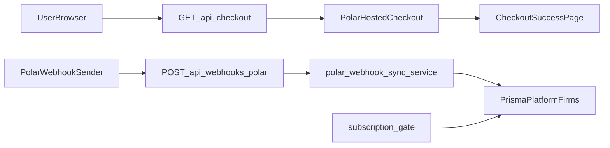

# Subscription HLD (Polar + Firma)

## Overview

This document defines the high-level design for subscription checkout and webhook-based billing sync.

## Architecture

## Components

### 1) Checkout API

- Path: `frontend/app/api/checkout/route.ts`
- Responsibilities:
  - Verify user identity from bearer token.
  - Validate firm membership.
  - Inject `customerExternalId = firmId`.
  - Inject metadata fallback `{ firmId }`.
  - Create Polar checkout via `@polar-sh/nextjs`.

### 2) Webhook API

- Path: `frontend/app/api/webhooks/polar/route.ts`
- Responsibilities:
  - Verify incoming webhook signature using `POLAR_WEBHOOK_SECRET`.
  - Handle subscription lifecycle events.
  - Call sync service with mapped internal status.

### 3) Webhook Sync Service

- Path: `frontend/lib/billing/polar-webhook-sync.ts`
- Responsibilities:
  - Parse payload fields defensively.
  - Resolve firm with deterministic priority:
    1. `customerExternalId`
    2. `metadata.firmId`
    3. `polarCustomerId`
    4. `polarSubscriptionId`
  - Resolve billing anchor firm when satellites share subscription.
  - Update subscription fields in `platform.firms`.

### 4) Billing Group Helpers

- Path: `frontend/lib/billing/billing-group.ts`
- Responsibilities:
  - Determine anchor firm via `billingSharesSubscriptionFromFirmId`.
  - Preserve existing shared-billing behavior for feature access checks.

## Data Model (Billing-Relevant Fields)

From `platform.firms`:

- `subscriptionStatus`
- `subscriptionProvider`
- `subscriptionPlan`
- `subscriptionCurrentPeriodEnd`
- `polarCustomerId`
- `polarSubscriptionId`
- `billingSharesSubscriptionFromFirmId`
- `billingGroupFirmCap`

## Event to Status Mapping

- `subscription.created` -> `trialing`
- `subscription.updated` -> `trialing` (may be refined with payload status in future)
- `subscription.active` -> `active`
- `subscription.canceled` -> `canceled`
- `subscription.revoked` -> `canceled`
- `subscription.uncanceled` -> `active`

## Environment Configuration

Required env vars:

- `POLAR_ACCESS_TOKEN`
- `POLAR_SERVER` (`sandbox` or `production`)
- `POLAR_SUCCESS_URL`
- `POLAR_WEBHOOK_SECRET`

### Local sandbox (localhost org)

- Webhook URL: `https://macbook-air.tail48717e.ts.net/api/webhooks/polar`
- Uses sandbox token for local sandbox org.

### Preview sandbox (preview org)

- Same code path, different token/secret and webhook URL under preview domain.

### Production

- Production token + production secret + production webhook URL.

## Security Considerations

- Checkout route requires authenticated user and firm membership.
- Webhook route rejects unsigned/invalid payloads (via Polar helper).
- OAT stays server-side only.
- No customer billing logic in browser.

## Observability

- Structured warning logs on:
  - webhook received event type,
  - mapping failures (no firm found),
  - successful sync outcomes (firm IDs and subscription IDs).

## Test Plan (High Level)

1. Create sandbox checkout for a known firm member and firm.
2. Complete payment with sandbox card.
3. Verify webhook delivery success in Polar dashboard.
4. Verify anchor firm fields updated in DB.
5. Replay event in Polar dashboard and confirm idempotent result.
6. Confirm gated endpoints behave for active/trialing vs canceled states when billing gates are enabled.
