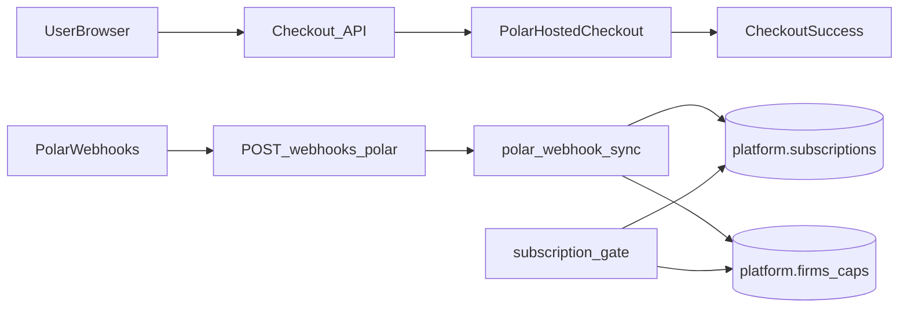

# Subscription HLD — Polar + Firma

**Companion:** [Subscriptions PRD](prd-subscriptions.md) (Polar contract + commercial plan content). **This HLD** covers only the **technical** flow (checkout → webhooks → DB), not duplicate product requirements.

## Overview

Checkout is Polar-hosted; subscription lifecycle updates arrive via webhooks and are written to **`platform.subscriptions`**. **`platform.firms`** stores billing **policy** (caps, billing-group pointers), not duplicate Polar subscription columns.

## Architecture

## Components

| Area | Path (typical) | Responsibility |
|------|----------------|------------------|
| Checkout | `frontend/app/api/checkout/...` | Auth, firm membership, `customerExternalId = firmId`, Polar session |
| Webhook | `frontend/app/api/webhooks/polar/route.ts` | Signature verify, delegate to sync |
| Sync | `frontend/lib/billing/polar-webhook-sync.ts` | Parse payload, resolve firm → **anchor**, upsert **`subscriptions`**, deactivate other active rows when needed, refresh JWT/caps hooks |
| Active row lookup | `frontend/lib/billing/active-billing-subscription.ts` | `getActiveSubscriptionForFirm`, Polar ID → `firmId` resolution |
| Billing anchor | `frontend/lib/billing/billing-group.ts` | `billingSharesSubscriptionFromFirmId` / `anchorFirmId` → anchor id; gate reads **subscription.status** from active row |

## Data model (billing-relevant)

**`platform.subscriptions`** (per firm id; one logical “active” row enforced in app + partial unique index):

- `status`, `plan`, `pricingModel`, `currentPeriodEnd`
- `polarCustomerId`, `polarSubscriptionId`, `polarOrderId`, `provider`, `active`, `settings` (JSON)

**`platform.firms`** (anchor and satellites):

- **Not** storing subscription status / Polar IDs on the firm row.
- **Caps / grouping:** e.g. `billingActiveEngagementCap`, `billingGroupFirmCap`, `billingCapsLocked`, `billingSharesSubscriptionFromFirmId`, `sandboxOnly`, etc.

## Event → status (handler)

Mapped in code (`mapPolarSubscriptionStatusToDb`); treat `subscription.*` events as triggers to upsert **`subscriptions`** for the anchor firm. See [prd-subscriptions.md#acceptance-criteria](prd-subscriptions.md#acceptance-criteria) for acceptance criteria.

## Environment

- `POLAR_ACCESS_TOKEN`, `POLAR_SERVER`, `POLAR_WEBHOOK_SECRET`, success URL envs as in app config.
- Separate Polar org + secrets per environment.

## Security

- Checkout: authenticated user + firm membership.
- Webhook: signature verification only (no session).
- Tokens server-side.

## Observability

- Structured logs: mapping failures, sync outcomes (firm id, subscription id).

## Test plan (high level)

1. Sandbox checkout for a known firm admin.
2. Complete payment; verify webhook success in Polar.
3. Verify **`platform.subscriptions`** row for **anchor** `firmId`.
4. Replay webhook; confirm idempotent behavior.
5. With billing gates enabled, confirm access vs canceled state.
6. Satellite firm: confirm reads resolve to anchor subscription.
