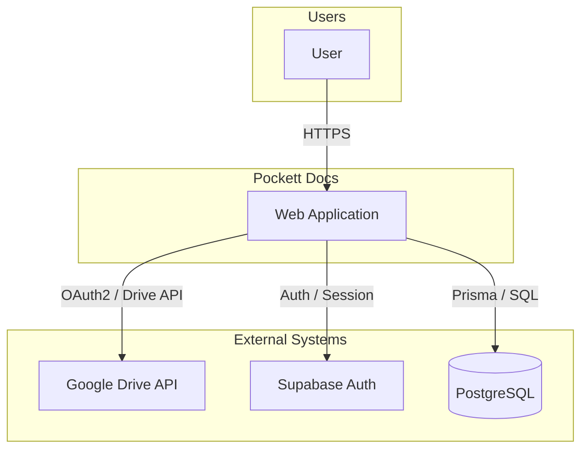
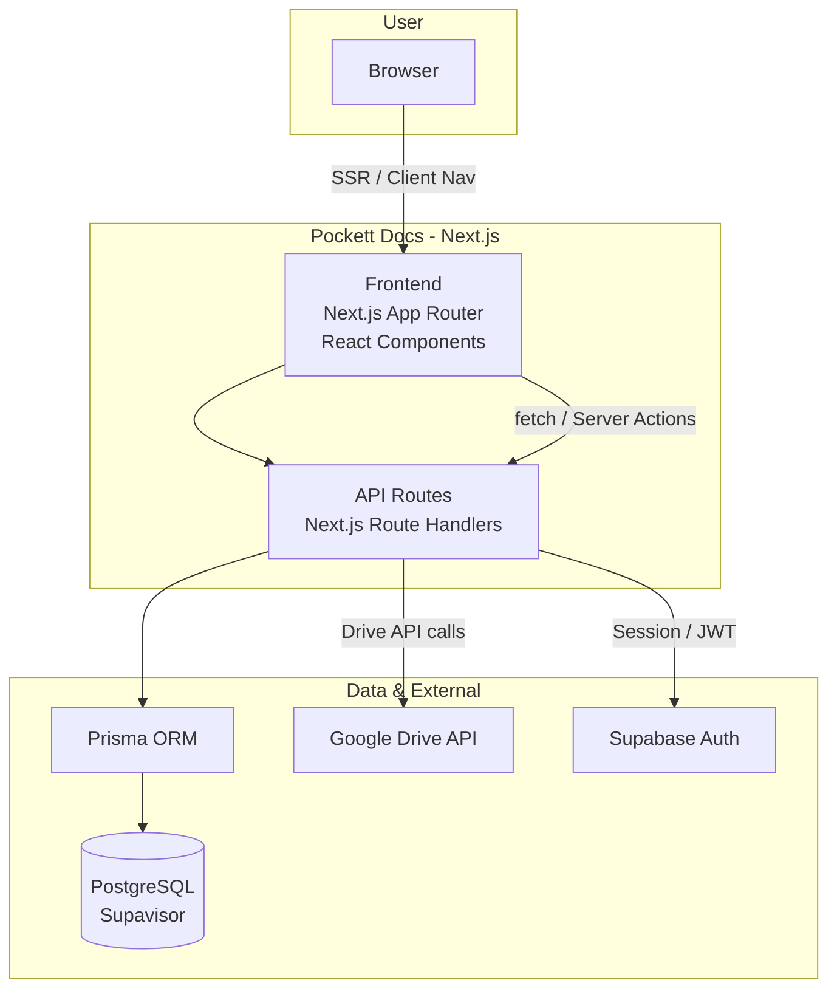
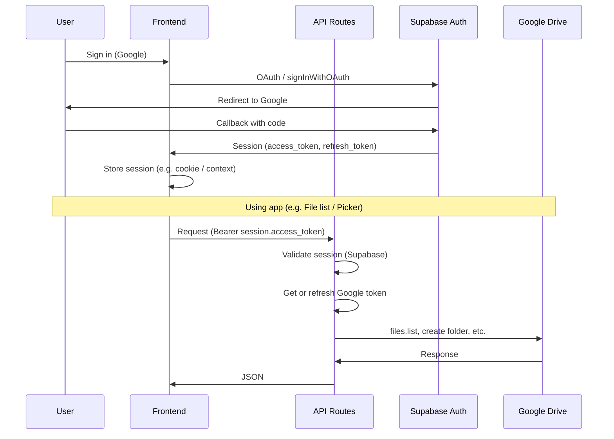
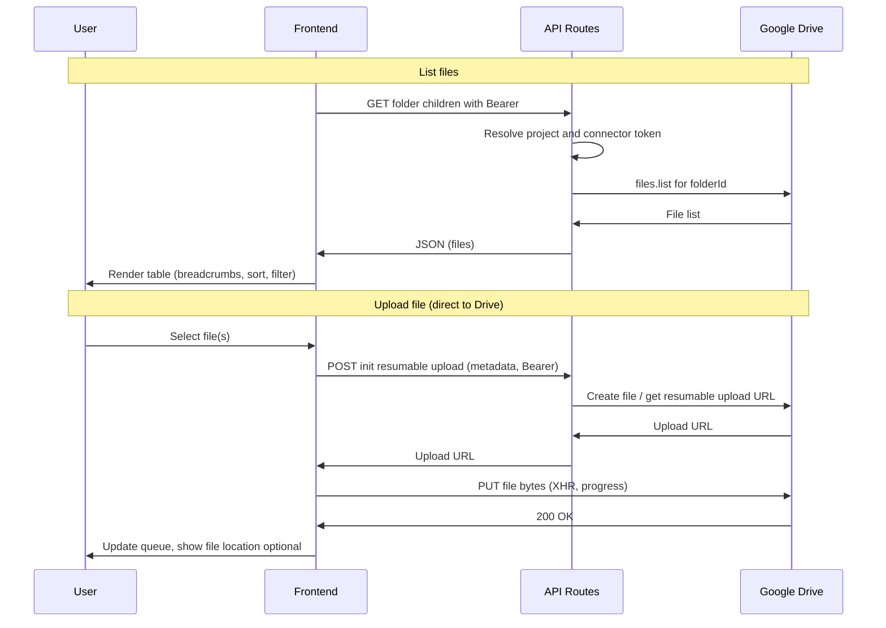
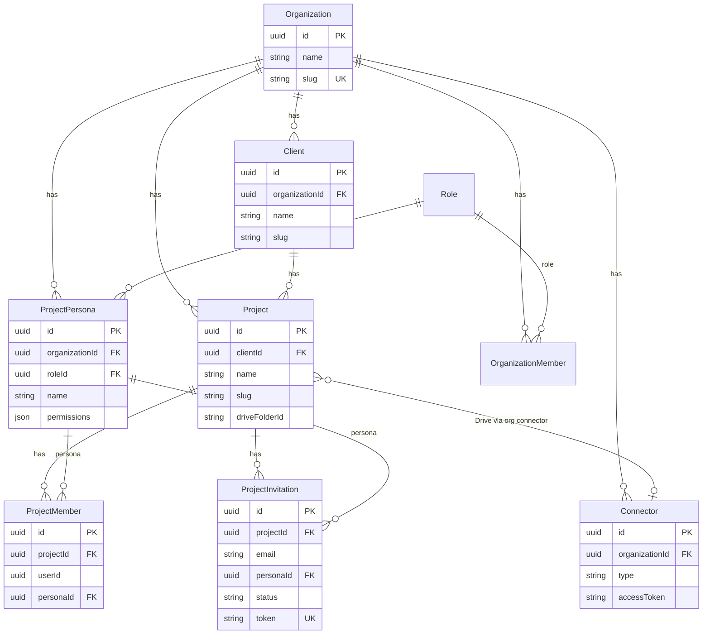
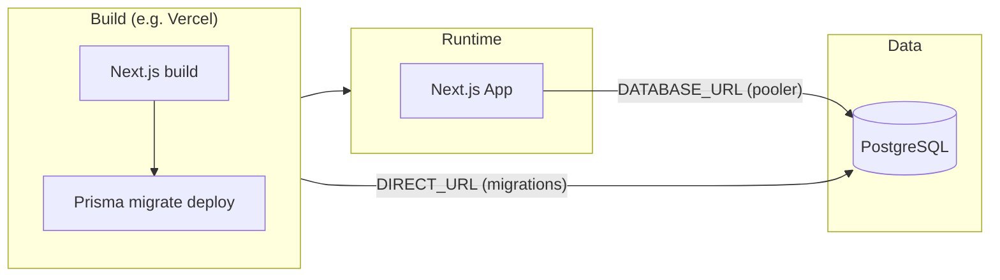

# High-Level Design (HLD): Pockett Docs MVP

This document describes the high-level architecture of the Pockett Docs MVP using Mermaid diagrams. It aligns with the [PRD](prd.md) and [Roadmap](roadmap.md).

**Revision:** MVP · Last updated with current implementation (file browser, Drive picker, members, invitations).

---

## Design Principles

| Principle | Description |
|-----------|-------------|
| **Direct-to-Drive** | File bytes go browser → Google Drive (resumable upload). Pockett servers never store or proxy file content; only metadata and upload URLs. |
| **Multi-tenant** | All data is scoped by Organization. Clients and Projects belong to an org; access is enforced via roles (ORG_OWNER, ORG_MEMBER, ORG_GUEST) and project personas. |
| **Headless Drive** | Pockett is the UI; Google Drive is the storage backend. Folder structure is created at project creation; file list and uploads use Drive API and Picker. |
| **Session-first auth** | Supabase handles Google OAuth and session. API routes validate session and resolve org/client/project context; connector tokens are used for Drive API on behalf of the org. |

---

## Technology Stack

| Layer | Technology |
|-------|------------|
| **Frontend** | Next.js (App Router), React, TypeScript |
| **API** | Next.js Route Handlers (REST), Server Actions where applicable |
| **Database** | PostgreSQL (Supavisor), Prisma ORM |
| **Auth** | Supabase Auth (Google OAuth) |
| **Storage / Files** | Google Drive API (metadata + resumable uploads), no Pockett file storage |
| **Hosting** | Vercel (Next.js build + postbuild Prisma migrate deploy) |
| **Observability** | Sentry (client, server, edge), structured logging |

---

## URL Structure

Main application routes:

| Route | Purpose |
|-------|---------|
| `/onboarding` | New user workspace creation (no org yet) |
| `/dash` | Dashboard; redirects to last-used client workspace |
| `/o/[slug]` | Organization scope (e.g. org home, connectors, insights) |
| `/o/[slug]/c/[clientSlug]` | Client scope; project list |
| `/o/[slug]/c/[clientSlug]/p/[projectSlug]` | Project workspace (Files, Members, Shares, Insights, Sources tabs) |
| `/invite/[token]` | Invitation redemption (sign-in/sign-up → project) |

Slugs are URL-friendly (org, client, project names). IDs are used in API and DB.

---

## Security & Compliance

### Authentication & Authorization

- **Authentication:** Supabase session (JWT). All API routes that need auth validate the session and resolve the user.
- **Authorization:** Org and project membership plus roles (ORG_OWNER, ORG_MEMBER, ORG_GUEST) and project personas. Invitation flow ensures invitee email matches authenticated user (no link forwarding).
- **Data scope:** Queries are scoped by `organizationId` (and client/project where applicable) in application code. Connector tokens are org-scoped; Drive folder IDs are stored per project. **Database:** Row-Level Security (RLS) — see Data & PII Protection.

---

### Direct-to-Drive Upload Security

File content never transits or persists on Pockett servers. Security measures (current and recommended):

| Measure | Current | Recommended (enterprise) |
|--------|----------|---------------------------|
| **Transport** | Browser → Google Drive over HTTPS (TLS 1.3). Pockett API only returns a resumable upload URL. | Same; enforce TLS 1.2+ and HSTS in production. |
| **Server-side file handling** | None. No file bytes stored or proxied. | Maintain this; do not introduce server-side buffering of file content. |
| **Upload URL lifecycle** | API issues one-time resumable URL; client uploads directly to Drive. | Short-lived upload URLs (e.g. 1-hour expiry); no reuse. Revoke or scope URLs to a single session/request. |
| **Token handling** | Connector OAuth tokens used server-side only to obtain upload URL; tokens not sent to browser. | Store tokens in server-side secrets or vault; never log or expose in responses. Rotate tokens on revoke. |
| **Validation** | Project and folder resolved from DB; upload URL scoped to project’s Drive folder. | Validate project membership and folder ownership before issuing upload URL; rate-limit per user/org. |
| **Audit** | (Optional) Log upload init (who, project, folder) without file content. | Log upload events (user, org, project, folderId, timestamp) for compliance and forensics. |

---

### Data & PII Protection

| Area | Current | Recommended (enterprise) |
|------|---------|---------------------------|
| **Row-Level Security (RLS)** | Access enforced in application layer only (Prisma queries filter by `organizationId` / `clientId` / `projectId`). No RLS policies at DB level. | **Enable PostgreSQL RLS** on multi-tenant tables (e.g. `organizations`, `clients`, `projects`, `connectors`, `project_members`, `project_invitations`). Policies should restrict rows by `organization_id` (and client/project where applicable) using a stable role or `current_setting('app.current_org_id')` set per request. Ensures that even if application code is bypassed or buggy, the DB cannot return rows from another tenant. |
| **Encryption in transit** | HTTPS for all client–server and server–DB traffic. | TLS 1.2+ everywhere; DB connection over TLS (Supavisor supports this). |
| **Encryption at rest (DB)** | Provided by DB host (e.g. Supabase/Postgres disk encryption). | Confirm provider uses AES-256 or equivalent; use encrypted backups. |
| **PII in database** | Email, names, and other PII stored in plaintext in PostgreSQL. | **Field-level or column-level encryption** for sensitive PII (e.g. email, display name in invitations/members). Use a KMS (e.g. AWS KMS, HashiCorp Vault) and encrypt before write, decrypt in app layer. Key rotation without re-encrypting all data (e.g. envelope encryption) as roadmap. |
| **Secrets** | Connector tokens and API keys in env / server config. | Secrets in a vault (e.g. Vercel env, Doppler, AWS Secrets Manager); no secrets in code or logs. |
| **Logging** | Structured logs; Sentry. | Redact or omit PII from logs (email, names, tokens). Use placeholders (e.g. `user_id=xxx`) for debugging. |
| **Retention** | No formal policy. | Define retention for PII and audit logs; automated purge or archive per policy and jurisdiction (e.g. GDPR). |

---

### Enterprise Best Practices (Current & Recommended)

| Practice | Current | Recommended |
|----------|---------|-------------|
| **Access reviews** | Manual. | Periodic review of org/project members and roles; deprovision on leave. |
| **SSO / SAML** | Google OAuth only. | Optional SAML/SSO for orgs (e.g. Okta, Azure AD) for enterprise customers. |
| **Audit logging** | Ad hoc. | Immutable audit log for sensitive actions (invite, role change, connector link, project create/delete). Store in append-only store or dedicated audit table with tamper detection. |
| **Backup & DR** | DB backups as per provider. | Automated DB backups; tested restore; RPO/RTO defined. Document recovery runbook. |
| **Incident response** | — | Runbook for breach or exposure; notification process; post-incident review. |
| **Compliance** | — | Map controls to SOC 2, GDPR, or HIPAA as needed; document in a security/compliance doc. |

---

**How to view the diagrams (Markdown Preview Mermaid Support):**
1. Open this file (`hld.md`) and use **Markdown: Open Preview** (**Cmd+Shift+V** / **Ctrl+Shift+V**) — *not* another extension’s preview (e.g. “Markdown Preview Enhanced”).
2. **If diagrams disappear after closing and reopening the preview:** Use **Markdown: Open Preview to the Side** (**Cmd+K V** / **Ctrl+K V**) and keep that preview pane open. The side preview tends to re-render Mermaid more reliably than reopening a closed tab. If it still doesn’t show diagrams, run **Developer: Reload Window** (Cmd+Shift+P → “Reload Window”), then open preview again.
3. Alternative: copy a `mermaid` code block into [mermaid.live](https://mermaid.live) or push and view on GitHub.

---

## 1. System Context (C4 Level 1)

Users interact with the Pockett web application. Pockett uses Google Drive for file storage, Supabase for authentication, and PostgreSQL (Supavisor) for application data.

---

## 2. Container Diagram (C4 Level 2)

The web application is a Next.js app comprising the browser UI and API routes. Application data is stored in PostgreSQL; file content lives in Google Drive.

---

## 3. Authentication Flow

Users sign in with Google (Supabase). Session is used for API authorization and for obtaining a Google access token (e.g. for Drive Picker and Drive API).

---

## 4. Project File List & Upload Flow

File browser lists contents of the project’s Drive folder. Uploads go directly from the browser to Google Drive (resumable upload); the API only issues the upload URL and metadata.

---

## 5. Core Data Model (Simplified)

Organizations contain Clients and Connectors. Projects belong to a Client and reference a Drive folder. Members and Invitations are scoped to Organization and Project; Personas define project-level roles.

---

## 6. Deployment Context

Next.js is built and deployed (e.g. Vercel). PostgreSQL is hosted (e.g. Supabase/Supavisor). Environment distinguishes runtime URL (transaction pooler) vs migration URL (session pooler).

---

## Glossary

| Term | Definition |
|------|------------|
| **Organization** | Top-level tenant; owns clients, projects, connectors, and personas. Users belong to one or more orgs via roles. |
| **Client** | Customer or entity (e.g. “Acme Corp”); belongs to an org; contains projects. |
| **Project** | Engagement or case; belongs to a client; linked to one Google Drive folder; has tabs (Files, Members, Shares, Insights, Sources). |
| **Connector** | Org-level link to an external service (e.g. Google Drive); stores OAuth tokens; used for Drive folder sync and Import from Drive. |
| **Persona** | Project-level role template (e.g. Project Owner, Internal Member, Associate, Client); defines permissions; assigned to members and invitations. |

---

## References

- [PRD](prd.md) – Product requirements and feature list
- [Roadmap](roadmap.md) – Milestones and schedule
- [AGENTS.md](../../AGENTS.md) – Database migrations, Vercel, Git workflow
