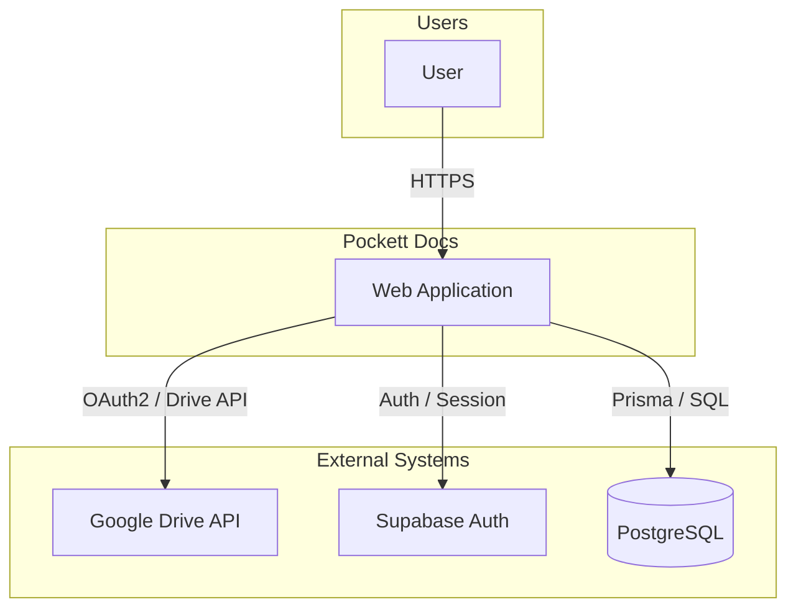
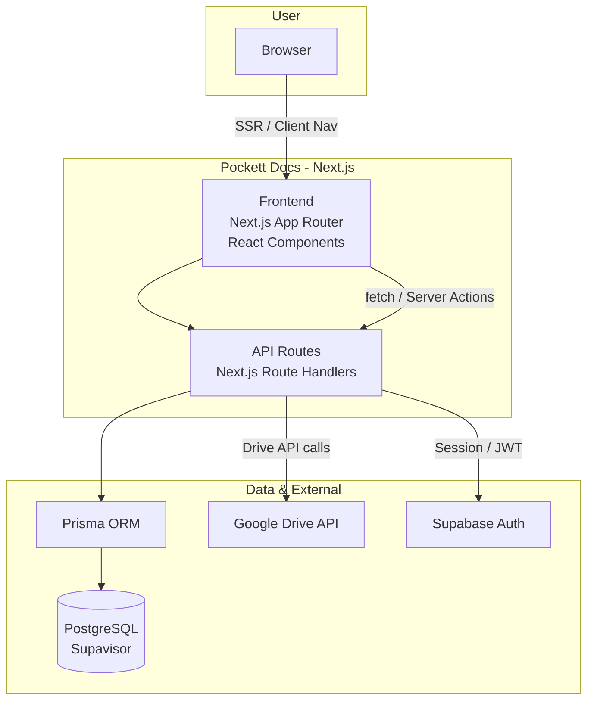
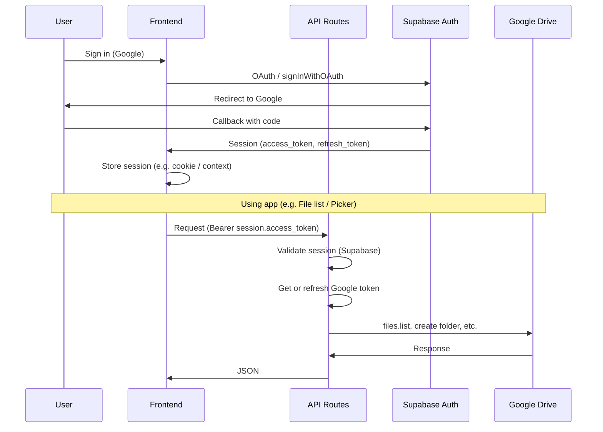
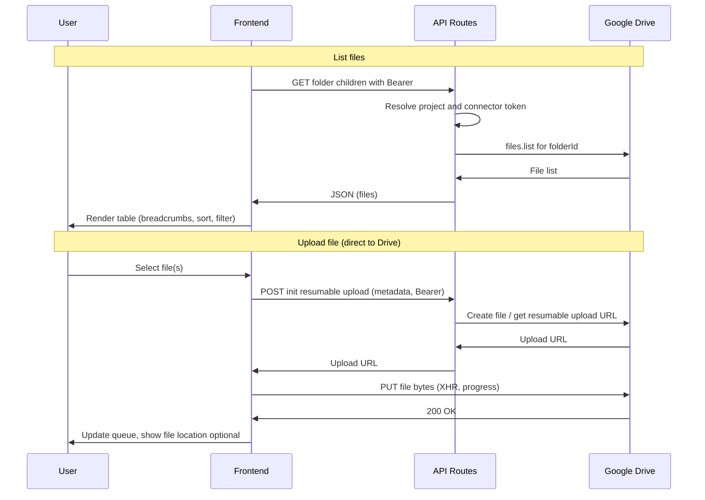
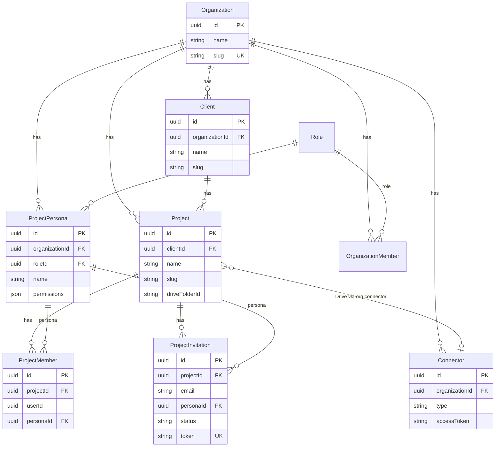
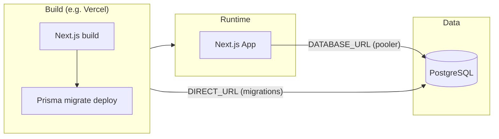

# High-Level Design (HLD): Pockett Docs MVP

This document describes the high-level architecture of the Pockett Docs MVP using Mermaid diagrams. It aligns with the [PRD](prd.md) and [Roadmap](roadmap.md).

**How to view the diagrams (Markdown Preview Mermaid Support):**
1. Open this file (`hld.md`) and use **Markdown: Open Preview** (**Cmd+Shift+V** / **Ctrl+Shift+V**) — *not* another extension’s preview (e.g. “Markdown Preview Enhanced”).
2. **If diagrams disappear after closing and reopening the preview:** Use **Markdown: Open Preview to the Side** (**Cmd+K V** / **Ctrl+K V**) and keep that preview pane open. The side preview tends to re-render Mermaid more reliably than reopening a closed tab. If it still doesn’t show diagrams, run **Developer: Reload Window** (Cmd+Shift+P → “Reload Window”), then open preview again.
3. Alternative: copy a `mermaid` code block into [mermaid.live](https://mermaid.live) or push and view on GitHub.

---

## 1. System Context (C4 Level 1)

Users interact with the Pockett web application. Pockett uses Google Drive for file storage, Supabase for authentication, and PostgreSQL (Supavisor) for application data.

---

## 2. Container Diagram (C4 Level 2)

The web application is a Next.js app comprising the browser UI and API routes. Application data is stored in PostgreSQL; file content lives in Google Drive.

---

## 3. Authentication Flow

Users sign in with Google (Supabase). Session is used for API authorization and for obtaining a Google access token (e.g. for Drive Picker and Drive API).

---

## 4. Project File List & Upload Flow

File browser lists contents of the project’s Drive folder. Uploads go directly from the browser to Google Drive (resumable upload); the API only issues the upload URL and metadata.

---

## 5. Core Data Model (Simplified)

Organizations contain Clients and Connectors. Projects belong to a Client and reference a Drive folder. Members and Invitations are scoped to Organization and Project; Personas define project-level roles.

---

## 6. Deployment Context

Next.js is built and deployed (e.g. Vercel). PostgreSQL is hosted (e.g. Supabase/Supavisor). Environment distinguishes runtime URL (transaction pooler) vs migration URL (session pooler).

---

## References

- [PRD](prd.md) – Product requirements and feature list
- [Roadmap](roadmap.md) – Milestones and schedule
- [AGENTS.md](../../AGENTS.md) – Database migrations, Vercel, Git workflow
