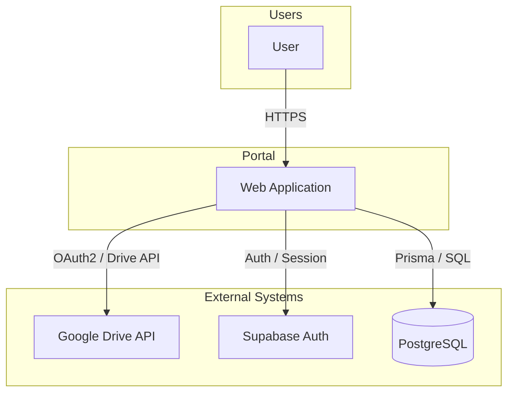
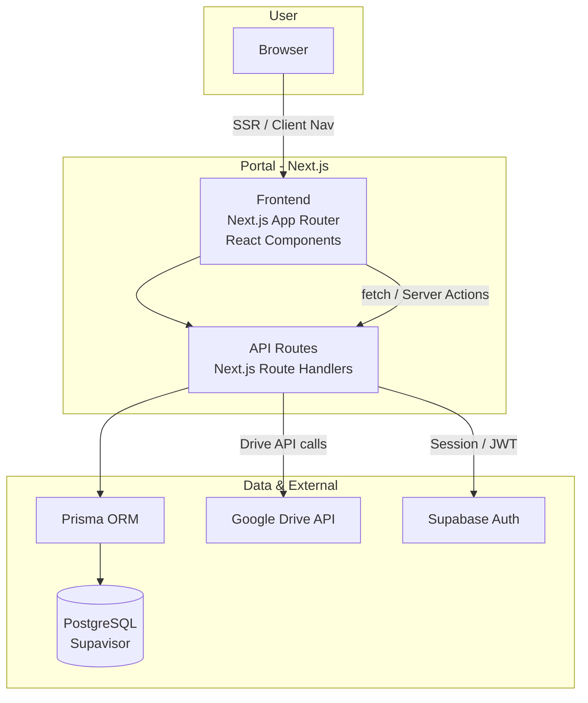
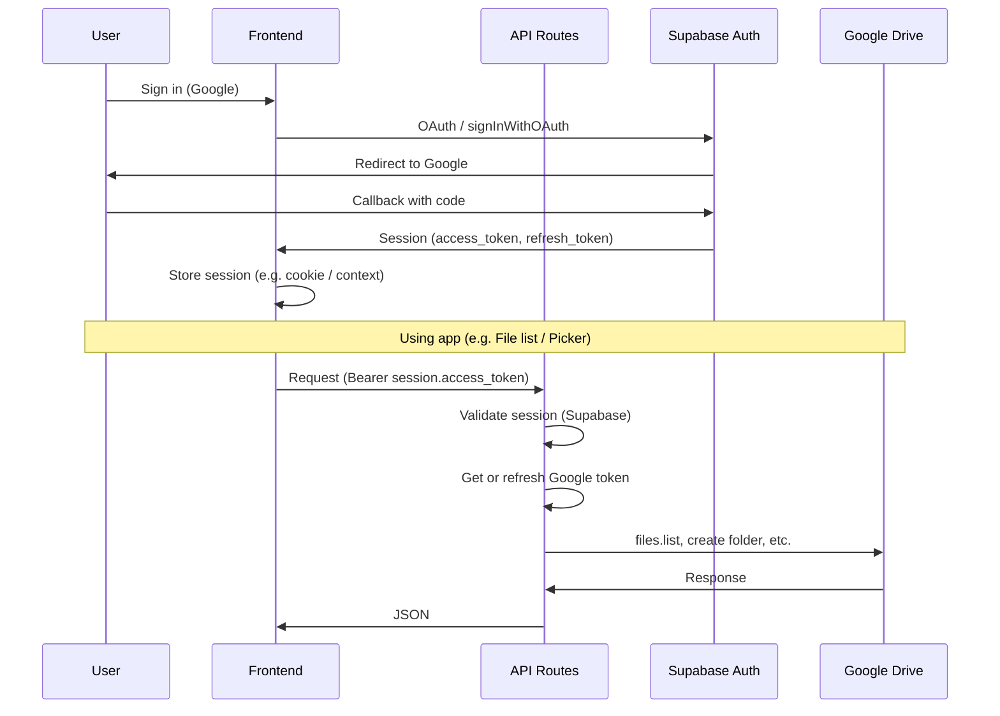
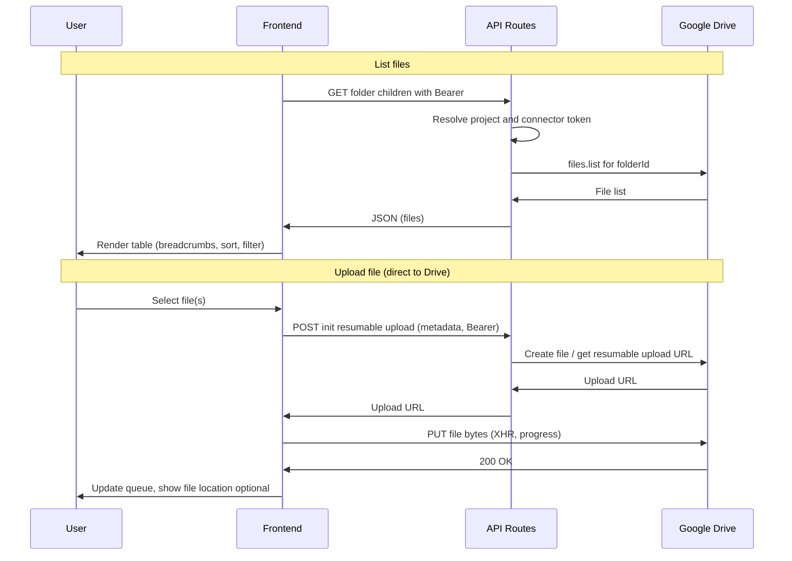
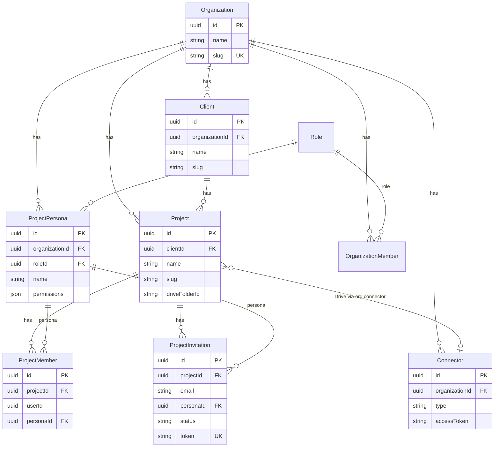
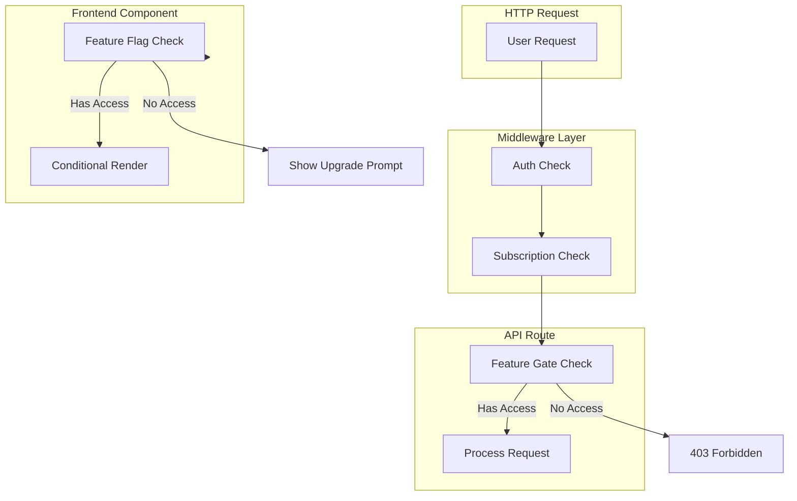
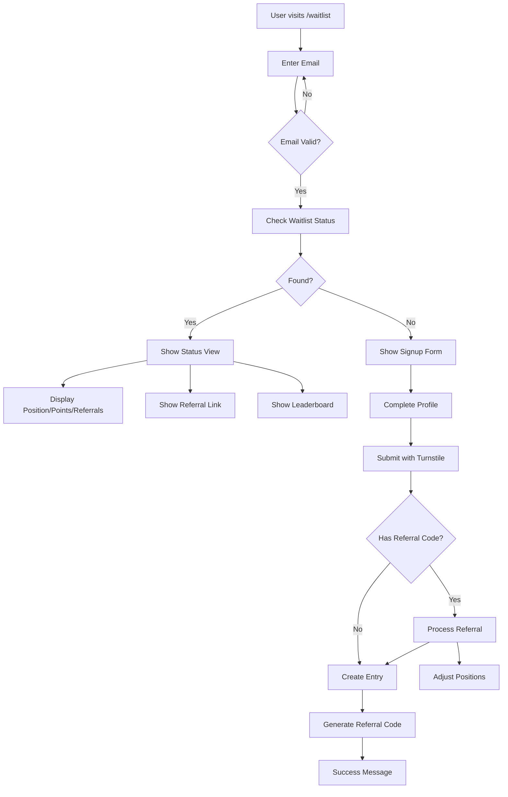
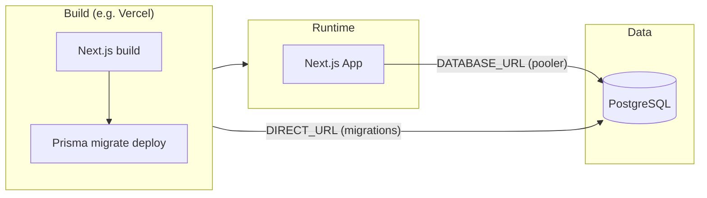

# HLD for Professional Client Portal for Document Delivery

This document describes the high-level architecture of the Professional Client Portal for Document Delivery using Mermaid diagrams. It aligns with the [PRD](prd.md) and [Roadmap](roadmap.md).

**Revision:** MVP · Last updated with current implementation (file browser, Drive picker, members, invitations).

---

## Design Principles

| Principle | Description |
| --------- | ----------- |
| **Direct-to-Drive** | File bytes go browser → Google Drive (resumable upload). Portal servers never store or proxy file content; only metadata and upload URLs. |
| **Multi-tenant** | All data is scoped by Organization. Clients and Projects belong to an org; access is enforced via roles (ORG_OWNER, ORG_MEMBER, ORG_GUEST) and project personas. |
| **Headless Drive** | Portal is the UI; Google Drive is the storage backend. Folder structure is created at project creation; file list and uploads use Drive API and Picker. |
| **Session-first auth** | Supabase handles Google OAuth and session. API routes validate session and resolve org/client/project context; connector tokens are used for Drive API on behalf of the org. |

---

## Technology Stack

| Layer | Technology |
| ----- | ---------- |
| **Frontend** | Next.js (App Router), React, TypeScript |
| **API** | Next.js Route Handlers (REST), Server Actions where applicable |
| **Database** | PostgreSQL (Supavisor), Prisma ORM |
| **Auth** | Supabase Auth (Google OAuth) |
| **Storage / Files** | Google Drive API (metadata + resumable uploads), no Portal file storage |
| **Hosting** | Vercel (Next.js build + postbuild Prisma migrate deploy) |
| **Observability** | Sentry (client, server, edge), structured logging |

---

## Database Schema Organization

The database uses multiple PostgreSQL schemas to separate user-facing application data from administrative data:

| Schema | Purpose | Tables |
| ------ | ------- | ------ |
| **`portal`** | User-facing application data | `organizations`, `clients`, `projects`, `organization_members`, `roles`, `role_permissions`, `connectors`, `documents`, `linked_files`, `project_members`, `project_personas`, `project_invitations`, `customer_requests` |
| **`admin`** | Administrative/internal data | `contact_submissions`, `waitlist` |
| **`public`** | Default schema (minimal use) | Reserved for PostgreSQL system objects |

**Rationale:**

- **Portal schema**: Contains all tables that users interact with directly. This includes support requests (`customer_requests`) so users can view their own tickets.
- **Admin schema**: Contains tables used only by internal administrators (e.g., contact form submissions from the marketing site).
- **Separation benefits**: Clear data boundaries, simplified access control, and easier compliance auditing.

All enums (`ConnectorType`, `ConnectorStatus`, `DocumentStatus`, `InvitationStatus`, `TicketType`, `TicketStatus`) are created in the `portal` schema since they are used by portal tables.

---

## URL Structure

Main application routes:

| Route | Purpose |
| ----- | ------- |
| `/onboarding` | New user workspace creation (no org yet) |
| `/dash` | Dashboard; redirects to last-used client workspace |
| `/o/[slug]` | Organization scope (e.g. org home, connectors, insights) |
| `/o/[slug]/c/[clientSlug]` | Client scope; project list |
| `/o/[slug]/c/[clientSlug]/p/[projectSlug]` | Project workspace (Files, Members, Shares, Insights, Sources tabs) |
| `/invite/[token]` | Invitation redemption (sign-in/sign-up → project) |
| `/waitlist` | Public waitlist signup page with referral system |
| `/pricing` | Public pricing page with plan comparison |
| `/internal/waitlist` | Admin view of waitlist entries |

Slugs are URL-friendly (org, client, project names). IDs are used in API and DB.

---

## Key API Surface

Main API route groups used by the app (Next.js Route Handlers under `app/api/`). LLD should specify request/response schemas, auth, and error handling per endpoint.

| Route group | Purpose |
| ----------- | ------- |
| `POST /api/organization/create` | Create organization (onboarding). |
| `GET/POST /api/organization`, `GET /api/organizations` | Org CRUD and list. |
| `GET /api/connectors/google-drive?action=token` | Get Google access token for Picker/Drive API. |
| `POST /api/connectors/google-drive/upload` | Init resumable upload (returns Drive upload URL); no file body. |
| `POST /api/connectors/google-drive/import` | Process Import from Drive (copy/shortcut selected files). |
| `GET /api/connectors/google-drive/callback` | OAuth callback for Google Drive connector. |
| `GET /api/documents/download` | Proxy or signed URL for document download. |
| `GET /api/drive-summary`, `GET /api/drive-metrics`, `POST /api/drive-action` | Drive summary, metrics, and actions (e.g. list children). |
| `POST /api/provision` | Provision project + Drive folder (project creation). |
| `POST /api/waitlist/submit` | Submit waitlist form (via Server Action: `submitWaitlistForm`). |
| `GET /api/waitlist/status` | Get waitlist status (via Server Action: `getWaitlistStatus`). |
| `GET /api/waitlist/leaderboard` | Get leaderboard data (via Server Action: `getWaitlistLeaderboard`). |
| `GET /api/waitlist/count` | Get waitlist count (via Server Action: `getWaitlistCount`). |

All authenticated routes expect `Authorization: Bearer <session.access_token>`. Org/client/project context is derived from request or path.

---

## Key Frontend Anchors

Main UI entry points and components that LLD can break down into subcomponents, state, and API calls.

| Area | Entry / key components |
| ---- | ----------------------- |
| **Onboarding** | `app/onboarding/page.tsx` — workspace name, slug, create org. |
| **Dashboard** | `app/dash/` — redirect to last client; sidebar layout. |
| **Org / Client / Project** | `app/o/[slug]/layout.tsx`, `c/[clientSlug]/page.tsx`, `p/[projectSlug]/page.tsx` — hierarchy; `ProjectWorkspace` with tabs. |
| **Project Files** | `ProjectFileList` — file table, breadcrumbs, Add menu, filters, sort, upload queue, Import from Drive, row actions. |
| **Waitlist** | `app/waitlist/page.tsx` — email check, dynamic branching, status view, signup form, leaderboard, referral link sharing. |
| **Pricing** | `app/pricing/page.tsx` — pricing cards, plan comparison, FAQ, CTAs. |
| **Project Members** | `ProjectMembersTab` — member list, invite modal, persona assignment. |
| **Connectors** | `app/o/[slug]/connectors/page.tsx` — Google Drive connect, link folders. |
| **Invitation** | `app/invite/[token]/page.tsx` — redeem invite, sign-in/sign-up, join project. |

---

## Security & Compliance

### Authentication & Authorization

- **Authentication:** Supabase session (JWT). All API routes that need auth validate the session and resolve the user.
- **Authorization:** Org and project membership plus roles (ORG_OWNER, ORG_MEMBER, ORG_GUEST) and project personas. Invitation flow ensures invitee email matches authenticated user (no link forwarding).
- **Data scope:** Queries are scoped by `organizationId` (and client/project where applicable) in application code. Connector tokens are org-scoped; Drive folder IDs are stored per project. **Database:** Row-Level Security (RLS) — see Data & PII Protection.

---

### Direct-to-Drive Upload Security

File content never transits or persists on Portal servers. Prescribed approach:

| Measure | Prescribed approach |
| ------- | -------------------- |
| **Transport** | Enforce TLS 1.2+ and HSTS in production. Browser → Google Drive over HTTPS; Portal API only returns a resumable upload URL. |
| **Server-side file handling** | Do not store or proxy file bytes. Do not introduce server-side buffering of file content. |
| **Upload URL lifecycle** | Short-lived upload URLs (e.g. 1-hour expiry); no reuse. Revoke or scope URLs to a single session/request. |
| **Token handling** | Store tokens in server-side secrets or vault; never log or expose in responses. Rotate tokens on revoke. Use connector OAuth tokens server-side only to obtain upload URL; do not send tokens to the browser. |
| **Validation** | Validate project membership and folder ownership before issuing upload URL; rate-limit per user/org. Scope upload URL to the project's Drive folder. |
| **Audit** | Log upload events (user, org, project, folderId, timestamp) for compliance and forensics; do not log file content. |

---

### Data & PII Protection

| Area | Prescribed approach |
| ---- | -------------------- |
| **Row-Level Security (RLS)** | Enable PostgreSQL RLS per table as below. Use `current_setting('app.current_org_id')` and, for project-scoped tables, project-membership checks. See **RLS multi-tenancy strategy** below. |
| **Encryption in transit** | TLS 1.2+ everywhere; DB connection over TLS (Supavisor supports this). |
| **Encryption at rest (DB)** | Confirm provider uses AES-256 or equivalent; use encrypted backups. |
| **PII in database** | Field-level or column-level encryption for sensitive PII (e.g. email, display name in invitations/members). Use a KMS or env-based key and encrypt before write, decrypt in app layer. Key rotation without re-encrypting all data (e.g. envelope encryption) as roadmap. |
| **Secrets** | Secrets in a vault (e.g. Vercel env, Doppler, AWS Secrets Manager); no secrets in code or logs. |
| **Logging** | Redact or omit PII from logs (email, names, tokens). Use placeholders (e.g. `user_id=xxx`) for debugging. |
| **Retention** | Define retention for PII and audit logs; automated purge or archive per policy and jurisdiction (e.g. GDPR). |

---

### Encryption: what to encrypt and how

**Advice only (no code changes).** Which data in the DB should be encrypted, and how to do it technically.

| Category | What | Should encrypt? | How (technical) |
| -------- | ---- | ---------------- | ---------------- |
| **PII** | User-identifying data: email (invitees, members, connectors), display names if stored. **Exclude:** `contact_submissions` (for Portal admins; do not encrypt). | **Yes** for enterprise/compliance. | **Application-level (field/column) encryption** with a KMS (e.g. AWS KMS, HashiCorp Vault). Encrypt before write, decrypt in app layer after read. Use envelope encryption: data key encrypted by KMS key; rotate KMS key without re-encrypting all rows. Store ciphertext in existing columns or dedicated columns; avoid indexing encrypted values for search (or use deterministic encryption for equality-only search with higher leakage risk). |
| **Business data of Portal clients** | Client name, project name, document title; you noted you only store fileId for Drive files (metadata like name comes from Drive API). | **Optional but recommended** for high-sensitivity clients. | Same as PII: application-level encryption with KMS. Encrypt `clients.name`, `projects.name`, `documents.title` (and any other business labels) before write. Decrypt in app for display. Search by name would require application-side decrypt-then-filter or a separate search index with encrypted/hashed tokens. |
| **Invitee / member emails** | `project_invitations.email`, `organization_members` (no email column today; user resolved via `userId` from Supabase). Connector `email` in `connectors`. | **Yes, if you want Portal admins (or DB access) to not see them in plaintext.** | Encrypt `project_invitations.email` and `connectors.email` (and any other email columns) with application-level encryption + KMS. Then only the app (with access to the key) can decrypt; DB backups and direct DB access show ciphertext. For invite redemption you must decrypt by token (token is unique) or store a hash for lookup and keep ciphertext for display. |

## Summary

- **PII:** Encrypt email, display names, and other PII (application-level, KMS, envelope encryption). Do **not** encrypt `contact_submissions` (for Portal admins).
- **Business data:** Encrypt client/project/document names if you want them protected at rest; you already avoid storing file content (only fileId/metadata).
- **Invitee/member emails:** Encrypt so Portal admins (or anyone with DB access) cannot read them directly; use app-level encryption and KMS; design invite flow so redemption works (e.g. lookup by token, decrypt email only in app).

**Technical approach (short):** One encryption layer that: gets a data key from KMS, encrypts (e.g. AES-256-GCM), stores ciphertext + IV/key id in DB; on read, decrypt in app. No plaintext or keys in logs. Use deterministic encryption only where you need equality search (e.g. email hash), accepting that equal values give equal ciphertext.

### What is KMS?

A **Key Management Service (KMS)** is a managed service that creates, stores, and protects **master keys** (Customer Master Keys, CMK). You never get the raw master key; you call the KMS via API to:

- **Generate a data key** — KMS returns a plaintext data key (used once in memory to encrypt your payload) and an encrypted copy of that data key (stored with your ciphertext; the “key id” identifies the CMK used to encrypt it).
- **Decrypt a data key** — You send the encrypted data key; KMS returns the plaintext data key so your app can decrypt the payload.

The master key never leaves the KMS. Encryption/decryption of your actual data (e.g. AES-256-GCM) happens **in your app** using the data key; the KMS only protects the data keys. That pattern is **envelope encryption**: one key (data key) encrypts the data, another key (master key in KMS) encrypts the data key.

#### KMS design with Vercel + Supabase

In a Vercel (app) + Supabase (DB) deployment:

- **Supabase** does not provide a KMS for application-level field encryption. It gives you encryption at rest (disk) and secure DB credentials; it does not hold “your” keys for encrypting columns. So the KMS is **outside** Supabase.
- **Vercel** runs your app (Next.js API routes, Server Actions). It does not provide a KMS either. Your app must call an **external KMS** (e.g. AWS KMS, Google Cloud KMS, HashiCorp Vault) over the network.

**Typical design:**

| Component | Role |
| --------- | ---- |
| **KMS** (e.g. AWS KMS, GCP KMS, Vault) | Holds the master key(s). Your app calls it to generate or decrypt data keys. Credentials (e.g. IAM role, service account key, Vault token) are provided via env vars or Vercel integrations. |
| **App (Vercel)** | On write: asks KMS for a new data key (or decrypts an existing encrypted data key by key id); encrypts plaintext with the data key (e.g. AES-256-GCM); stores **ciphertext + IV + key id** in the DB. On read: loads ciphertext + IV + key id; asks KMS to decrypt the data key; decrypts in app; returns plaintext. Never logs plaintext or keys. |
| **Supabase (Postgres)** | Stores only **ciphertext**, **IV**, and **key id** (and optional hash for equality search). No plaintext PII and no keys. |

**Data flow (write):** User input (plaintext) → Vercel → KMS (generate data key; get back plaintext data key + encrypted data key) → App encrypts with data key → App sends ciphertext + IV + key id to Supabase → Supabase stores. The plaintext data key is discarded after use.

**Data flow (read):** Supabase returns ciphertext + IV + key id → Vercel → KMS (decrypt data key by key id) → App decrypts with data key → Plaintext returned to caller. Again, no plaintext or keys in logs.

**Practical options:** Use **AWS KMS** (if you use AWS for anything else), **Google Cloud KMS** (if you use GCP), or **HashiCorp Vault** (self-hosted or HCP). Configure credentials in Vercel (e.g. `AWS_ACCESS_KEY_ID`, `AWS_SECRET_ACCESS_KEY`, `AWS_REGION`, and KMS key id) or Vault address + token, and ensure only server-side code (API routes / Server Actions) can access them.

#### Do you strictly need an external KMS? (Env-based key)

**No.** You can use a **single secret in Vercel env** (e.g. a base encryption key or a SALT used to derive a key) as the “key source” for your one encryption layer. The same technical approach applies: get the key from env (or derive from env + fixed context), encrypt with AES-256-GCM, store ciphertext + IV in DB; on read, decrypt in app. No plaintext or keys in logs; deterministic encryption only where you need equality search.

**What you get with env-based key:**

- One encryption layer, no external service. Simpler ops and no KMS cost.
- Strong crypto (AES-256-GCM) and no PII/keys in logs still satisfy many security and compliance expectations.
- For **ISO 27001**, use of cryptography (A.10) can be met by documenting that you use approved algorithms and protect the key (e.g. env var, access control, no logging). You do **not** strictly need an HSM or external KMS for certification, though auditors may prefer key separation and rotation.

**What you give up vs external KMS:**

- **Key rotation:** Rotating the env key means re-encrypting all existing ciphertext with a new key; with a KMS and envelope encryption, you can rotate the master key without re-encrypting every row.
- **Key separation:** The encryption key lives in the same place as other app config (Vercel env). A KMS keeps the master key in a dedicated, often HSM-backed, service.
- **Auditor preference:** Some auditors or customers expect “keys in a KMS/HSM” for higher-assurance or regulated workloads; an env-based key is easier to question in those contexts.

**Recommendation:** For MVP and many ISO 27001 / ISO 27701–oriented deployments, **a strong secret in Vercel env is acceptable** if you: (1) use a long, random key (e.g. 256-bit); (2) restrict env access (e.g. Vercel project settings, no client exposure); (3) document key handling and that plaintext/keys are never logged. Introduce an external KMS when you need key rotation without re-encrypting everything or when a customer/auditor requires it.

---

### RLS multi-tenancy strategy

Multi-tenancy is at **organization level** (tenant = Organization). RLS is applied to tables in the **`portal`** schema. The **`admin`** schema tables (`contact_submissions`) do not use RLS as they are admin-only.

RLS can and should be applied at **different levels for different tables**:

| Level | Tables (in `portal` schema) | Policy basis | Notes |
| ----- | ---------------------------- | ------------ | ----- |
| **Org-level** | `organizations`, `clients`, `projects`, `connectors`, `project_personas`, `organization_members`, `customer_requests` | Restrict by `organization_id = current_setting('app.current_org_id')::uuid`. For `organizations`, `id = current_setting('app.current_org_id')::uuid`. For `customer_requests`, filter by `userId` or `organizationId` as appropriate. | User may only see rows belonging to the org they are acting in. App sets `app.current_org_id` per request (e.g. from path or session). |
| **Project-level (project-membership)** | `project_members`, `project_invitations` | Restrict to rows where the user is a member of that project, e.g. `project_id IN (SELECT project_id FROM project_members WHERE user_id = current_setting('app.current_user_id')::uuid)`. | Only project members may see that project's members and invitations. Avoids org-wide visibility of project-scoped data. |
| **Org or project (by model)** | `documents`, `linked_files` | If project-scoped: same as project-level. If org-scoped: by `organization_id`. | Align with how the app uses these tables (e.g. `documents` has `organizationId` and optional `projectId`). |

**Summary:** Use **org-level RLS** for org-owned tables in the `portal` schema; use **project-level (membership-based) RLS** for project-scoped tables. Different tables may have RLS at different levels. The `admin` schema is excluded from RLS as it contains admin-only data.

**Implementation:** The app must set session variables at the start of each request (before any Prisma query): `SET LOCAL app.current_org_id = '<uuid>'; SET LOCAL app.current_user_id = '<uuid>';` (e.g. in middleware or an API wrapper that resolves org and user from the session). These variables apply to queries in the `portal` schema.

---

### Enterprise Best Practices

| Practice | Prescribed approach |
| -------- | -------------------- |
| **Access reviews** | Periodic review of org/project members and roles; deprovision on leave. |
| **SSO / SAML** | Optional SAML/SSO for orgs (e.g. Okta, Azure AD) for enterprise customers. |
| **Audit logging** | Immutable audit log for sensitive actions (invite, role change, connector link, project create/delete). Store in append-only store or dedicated audit table with tamper detection. |
| **Backup & DR** | Automated DB backups; tested restore; RPO/RTO defined. Document recovery runbook. |
| **Incident response** | Runbook for breach or exposure; notification process; post-incident review. |
| **Compliance** | Map controls to SOC 2, GDPR, or ISO as needed; document in a security/compliance doc. |

---

### Gap analysis (internal)

Gap analysis against ISO 27001 and ISO 27701 is documented separately in **`hld-nfr.md`** (internal; not for customer sharing).

---

## How to view the diagrams (Markdown Preview Mermaid Support)

1. Open this file (`hld.md`) and use **Markdown: Open Preview** (**Cmd+Shift+V** / **Ctrl+Shift+V**) — *not* another extension's preview (e.g. "Markdown Preview Enhanced").
2. **If diagrams disappear after closing and reopening the preview:** Use **Markdown: Open Preview to the Side** (**Cmd+K V** / **Ctrl+K V**) and keep that preview pane open. The side preview tends to re-render Mermaid more reliably than reopening a closed tab. If it still doesn't show diagrams, run **Developer: Reload Window** (Cmd+Shift+P → "Reload Window"), then open preview again.
3. Alternative: copy a `mermaid` code block into [mermaid.live](https://mermaid.live) or push and view on GitHub.

---

## 1. System Context (C4 Level 1)

Users interact with the Portal web application. Portal uses Google Drive for file storage, Supabase for authentication, and PostgreSQL (Supavisor) for application data.



---

## 2. Container Diagram (C4 Level 2)

The web application is a Next.js app comprising the browser UI and API routes. Application data is stored in PostgreSQL; file content lives in Google Drive.



---

## 3. Authentication Flow

Users sign in with Google (Supabase). Session is used for API authorization and for obtaining a Google access token (e.g. for Drive Picker and Drive API).



---

## 4. Project File List & Upload Flow

File browser lists contents of the project’s Drive folder. Uploads go directly from the browser to Google Drive (resumable upload); the API only issues the upload URL and metadata.



---

## 5. Core Data Model (Simplified)

Organizations contain Clients and Connectors. Projects belong to a Client and reference a Drive folder. Members and Invitations are scoped to Organization and Project; Personas define project-level roles.

**Schema organization:** All tables shown below (except `contact_submissions` and `waitlist`) are in the **`portal`** schema. The `admin` schema contains `contact_submissions` and `waitlist` (not shown in diagram).

**Note:** File Assignment feature (planned) will require a new `FileAssignment` table to track which files are assigned to which external members. This table will link `fileId` (Google Drive file ID), `projectId`, `memberId` (ProjectMember ID), `assignedAt`, and `assignedBy` (userId).



---

## 6. Feature Flagging & Subscription Management

### Overview

Feature flagging enables tiered access control based on subscription plans (Pro, Business, Enterprise). Features are gated at multiple layers: database schema, API routes, and UI components.

### Architecture Overview

Feature flagging will be implemented using a combination of:
1. **Database-driven flags**: Subscription tier stored in `Organization` table
2. **Runtime checks**: Feature gates in application code
3. **UI conditional rendering**: Hide/show features based on subscription tier
4. **API-level enforcement**: Backend validation of feature access

### Database Schema

```prisma
model Organization {
  id                String            @id @default(dbgenerated("gen_random_uuid()")) @db.Uuid
  // ... existing fields
  subscriptionTier  SubscriptionTier  @default(FREE)
  subscriptionStatus SubscriptionStatus @default(ACTIVE)
  subscriptionExpiresAt DateTime?
  // ... other fields
}

enum SubscriptionTier {
  FREE      // Legacy/Free tier (limited features)
  PRO       // Pro plan - Release 1.0 (Q2 2026)
  PRO_PLUS  // Pro Plus plan - Release 1.5 (Q2 2026)
  BUSINESS  // Business plan - Release 2.0 (Q3 2026)
  ENTERPRISE // Enterprise plan - Release 3.0 (Q4 2026)
}

enum SubscriptionStatus {
  ACTIVE
  TRIAL
  EXPIRED
  CANCELLED
}
```

### Feature Gate Utility

Create a centralized feature gate utility:

```typescript
// lib/features/subscription-gates.ts

export enum Feature {
  FILE_ASSIGNMENT = 'file_assignment',
  DOCUMENT_TEMPLATES = 'document_templates',
  PROJECT_TEMPLATES = 'project_templates',
  DUPLICATE_PROJECT = 'duplicate_project',
  REVIEW_SYSTEM = 'review_system',
  ADVANCED_REVIEW = 'advanced_review',
  DOCUMENT_VERSIONING = 'document_versioning',
  WATERMARKING = 'watermarking',
  TRACK_TAB = 'track_tab',
  CUSTOM_BRANDED_PORTAL = 'custom_branded_portal',
  CUSTOM_SUBDOMAIN = 'custom_subdomain',
  CUSTOM_DNS_DOMAIN = 'custom_dns_domain',
  DOCUMENT_RELATIONSHIPS = 'document_relationships',
  AUTOMATED_FOLLOWUPS = 'automated_followups',
  CALENDAR_INTEGRATION = 'calendar_integration',
  PROJECT_DUE_DATE_REMINDERS = 'project_due_date_reminders',
  WEEKLY_STATUS_REPORTS = 'weekly_status_reports',
  ACTIVITY_AUDITING = 'activity_auditing',
  RECYCLE_BIN_RECOVERY = 'recycle_bin_recovery',
  IP_THEFT_PROTECTION = 'ip_theft_protection',
  CUSTOM_TRIGGERS = 'custom_triggers',
  SSO_INTEGRATION = 'sso_integration',
}

export const FEATURE_TIER_MAP: Record<Feature, SubscriptionTier[]> = {
  // Pro features (available in Pro, Pro Plus, Business, Enterprise)
  [Feature.FILE_ASSIGNMENT]: [SubscriptionTier.PRO, SubscriptionTier.PRO_PLUS, SubscriptionTier.BUSINESS, SubscriptionTier.ENTERPRISE],
  [Feature.REVIEW_SYSTEM]: [SubscriptionTier.PRO, SubscriptionTier.PRO_PLUS, SubscriptionTier.BUSINESS, SubscriptionTier.ENTERPRISE],
  
  // Pro Plus features (available in Pro Plus, Business, Enterprise)
  [Feature.DOCUMENT_TEMPLATES]: [SubscriptionTier.PRO_PLUS, SubscriptionTier.BUSINESS, SubscriptionTier.ENTERPRISE],
  [Feature.PROJECT_TEMPLATES]: [SubscriptionTier.PRO_PLUS, SubscriptionTier.BUSINESS, SubscriptionTier.ENTERPRISE],
  [Feature.DUPLICATE_PROJECT]: [SubscriptionTier.PRO_PLUS, SubscriptionTier.BUSINESS, SubscriptionTier.ENTERPRISE],
  [Feature.ADVANCED_REVIEW]: [SubscriptionTier.PRO_PLUS, SubscriptionTier.BUSINESS, SubscriptionTier.ENTERPRISE],
  [Feature.DOCUMENT_VERSIONING]: [SubscriptionTier.PRO_PLUS, SubscriptionTier.BUSINESS, SubscriptionTier.ENTERPRISE],
  [Feature.WATERMARKING]: [SubscriptionTier.PRO_PLUS, SubscriptionTier.BUSINESS, SubscriptionTier.ENTERPRISE],
  [Feature.TRACK_TAB]: [SubscriptionTier.PRO_PLUS, SubscriptionTier.BUSINESS, SubscriptionTier.ENTERPRISE],
  [Feature.PROJECT_DUE_DATE_REMINDERS]: [SubscriptionTier.PRO_PLUS, SubscriptionTier.BUSINESS, SubscriptionTier.ENTERPRISE],
  [Feature.CUSTOM_BRANDED_PORTAL]: [SubscriptionTier.PRO_PLUS, SubscriptionTier.BUSINESS, SubscriptionTier.ENTERPRISE],
  
  // Business features (available in Business, Enterprise)
  [Feature.CUSTOM_SUBDOMAIN]: [SubscriptionTier.BUSINESS, SubscriptionTier.ENTERPRISE],
  [Feature.DOCUMENT_RELATIONSHIPS]: [SubscriptionTier.BUSINESS, SubscriptionTier.ENTERPRISE],
  [Feature.AUTOMATED_FOLLOWUPS]: [SubscriptionTier.BUSINESS, SubscriptionTier.ENTERPRISE],
  [Feature.CALENDAR_INTEGRATION]: [SubscriptionTier.BUSINESS, SubscriptionTier.ENTERPRISE],
  [Feature.WEEKLY_STATUS_REPORTS]: [SubscriptionTier.BUSINESS, SubscriptionTier.ENTERPRISE],
  
  // Enterprise features (Enterprise only)
  [Feature.CUSTOM_DNS_DOMAIN]: [SubscriptionTier.ENTERPRISE],
  [Feature.ACTIVITY_AUDITING]: [SubscriptionTier.ENTERPRISE],
  [Feature.RECYCLE_BIN_RECOVERY]: [SubscriptionTier.ENTERPRISE],
  [Feature.IP_THEFT_PROTECTION]: [SubscriptionTier.ENTERPRISE],
  [Feature.CUSTOM_TRIGGERS]: [SubscriptionTier.ENTERPRISE],
  [Feature.SSO_INTEGRATION]: [SubscriptionTier.ENTERPRISE],
};

export function hasFeatureAccess(
  subscriptionTier: SubscriptionTier,
  feature: Feature
): boolean {
  const allowedTiers = FEATURE_TIER_MAP[feature] || [];
  return allowedTiers.includes(subscriptionTier);
}
```

### Feature Gate Architecture



### Implementation Layers

#### 1. Database Layer

Subscription tier is stored in `Organization` table and checked via Prisma queries:

```typescript
// lib/features/subscription-gates.ts
export enum Feature {
  FILE_ASSIGNMENT = 'file_assignment',
  DOCUMENT_TEMPLATES = 'document_templates',
  PROJECT_TEMPLATES = 'project_templates',
  DUPLICATE_PROJECT = 'duplicate_project',
  REVIEW_SYSTEM = 'review_system',
  ADVANCED_REVIEW = 'advanced_review',
  DOCUMENT_VERSIONING = 'document_versioning',
  WATERMARKING = 'watermarking',
  TRACK_TAB = 'track_tab',
  CUSTOM_BRANDED_PORTAL = 'custom_branded_portal',
  CUSTOM_SUBDOMAIN = 'custom_subdomain',
  CUSTOM_DNS_DOMAIN = 'custom_dns_domain',
  DOCUMENT_RELATIONSHIPS = 'document_relationships',
  AUTOMATED_FOLLOWUPS = 'automated_followups',
  CALENDAR_INTEGRATION = 'calendar_integration',
  PROJECT_DUE_DATE_REMINDERS = 'project_due_date_reminders',
  WEEKLY_STATUS_REPORTS = 'weekly_status_reports',
  ACTIVITY_AUDITING = 'activity_auditing',
  RECYCLE_BIN_RECOVERY = 'recycle_bin_recovery',
  IP_THEFT_PROTECTION = 'ip_theft_protection',
  CUSTOM_TRIGGERS = 'custom_triggers',
  SSO_INTEGRATION = 'sso_integration',
}

export const FEATURE_TIER_MAP: Record<Feature, SubscriptionTier[]> = {
  // Pro features (available in Pro, Pro Plus, Business, Enterprise)
  [Feature.FILE_ASSIGNMENT]: [SubscriptionTier.PRO, SubscriptionTier.PRO_PLUS, SubscriptionTier.BUSINESS, SubscriptionTier.ENTERPRISE],
  [Feature.REVIEW_SYSTEM]: [SubscriptionTier.PRO, SubscriptionTier.PRO_PLUS, SubscriptionTier.BUSINESS, SubscriptionTier.ENTERPRISE],
  
  // Pro Plus features (available in Pro Plus, Business, Enterprise)
  [Feature.DOCUMENT_TEMPLATES]: [SubscriptionTier.PRO_PLUS, SubscriptionTier.BUSINESS, SubscriptionTier.ENTERPRISE],
  [Feature.PROJECT_TEMPLATES]: [SubscriptionTier.PRO_PLUS, SubscriptionTier.BUSINESS, SubscriptionTier.ENTERPRISE],
  [Feature.DUPLICATE_PROJECT]: [SubscriptionTier.PRO_PLUS, SubscriptionTier.BUSINESS, SubscriptionTier.ENTERPRISE],
  [Feature.ADVANCED_REVIEW]: [SubscriptionTier.PRO_PLUS, SubscriptionTier.BUSINESS, SubscriptionTier.ENTERPRISE],
  [Feature.DOCUMENT_VERSIONING]: [SubscriptionTier.PRO_PLUS, SubscriptionTier.BUSINESS, SubscriptionTier.ENTERPRISE],
  [Feature.WATERMARKING]: [SubscriptionTier.PRO_PLUS, SubscriptionTier.BUSINESS, SubscriptionTier.ENTERPRISE],
  [Feature.TRACK_TAB]: [SubscriptionTier.PRO_PLUS, SubscriptionTier.BUSINESS, SubscriptionTier.ENTERPRISE],
  [Feature.PROJECT_DUE_DATE_REMINDERS]: [SubscriptionTier.PRO_PLUS, SubscriptionTier.BUSINESS, SubscriptionTier.ENTERPRISE],
  [Feature.CUSTOM_BRANDED_PORTAL]: [SubscriptionTier.PRO_PLUS, SubscriptionTier.BUSINESS, SubscriptionTier.ENTERPRISE],
  
  // Business features (available in Business, Enterprise)
  [Feature.CUSTOM_SUBDOMAIN]: [SubscriptionTier.BUSINESS, SubscriptionTier.ENTERPRISE],
  [Feature.DOCUMENT_RELATIONSHIPS]: [SubscriptionTier.BUSINESS, SubscriptionTier.ENTERPRISE],
  [Feature.AUTOMATED_FOLLOWUPS]: [SubscriptionTier.BUSINESS, SubscriptionTier.ENTERPRISE],
  [Feature.CALENDAR_INTEGRATION]: [SubscriptionTier.BUSINESS, SubscriptionTier.ENTERPRISE],
  [Feature.WEEKLY_STATUS_REPORTS]: [SubscriptionTier.BUSINESS, SubscriptionTier.ENTERPRISE],
  
  // Enterprise features (Enterprise only)
  [Feature.CUSTOM_DNS_DOMAIN]: [SubscriptionTier.ENTERPRISE],
  [Feature.ACTIVITY_AUDITING]: [SubscriptionTier.ENTERPRISE],
  [Feature.RECYCLE_BIN_RECOVERY]: [SubscriptionTier.ENTERPRISE],
  [Feature.IP_THEFT_PROTECTION]: [SubscriptionTier.ENTERPRISE],
  [Feature.CUSTOM_TRIGGERS]: [SubscriptionTier.ENTERPRISE],
  [Feature.SSO_INTEGRATION]: [SubscriptionTier.ENTERPRISE],
};

export function hasFeatureAccess(
  subscriptionTier: SubscriptionTier,
  feature: Feature
): boolean {
  const allowedTiers = FEATURE_TIER_MAP[feature] || [];
  return allowedTiers.includes(subscriptionTier);
}
```

#### 2. API Layer

All API routes validate feature access before processing:

```typescript
// app/api/projects/[id]/assign-file/route.ts
import { hasFeatureAccess, Feature } from '@/lib/features/subscription-gates';
import { getOrganizationSubscriptionTier } from '@/lib/subscription';

export async function POST(request: Request, { params }: { params: { id: string } }) {
  const org = await getCurrentOrganization();
  const tier = await getOrganizationSubscriptionTier(org.id);
  
  if (!hasFeatureAccess(tier, Feature.FILE_ASSIGNMENT)) {
    return Response.json(
      { error: 'Feature not available in your plan. Upgrade to Pro.' },
      { status: 403 }
    );
  }
  
  // Process file assignment...
}
```

#### 3. Middleware Layer

Subscription validation middleware for protected routes:

```typescript
// middleware.ts or lib/middleware/subscription.ts
export async function validateSubscription(
  organizationId: string,
  requiredFeature: Feature
): Promise<boolean> {
  const org = await prisma.organization.findUnique({
    where: { id: organizationId },
    select: { subscriptionTier: true, subscriptionStatus: true }
  });
  
  if (!org || org.subscriptionStatus !== 'ACTIVE') {
    return false;
  }
  
  return hasFeatureAccess(org.subscriptionTier, requiredFeature);
}
```

#### 4. Frontend Layer

UI components conditionally render based on subscription tier:

```typescript
// components/projects/FileAssignmentButton.tsx
'use client';

import { useOrganization } from '@/hooks/use-organization';
import { hasFeatureAccess, Feature } from '@/lib/features/subscription-gates';

export function FileAssignmentButton({ fileId }: { fileId: string }) {
  const { organization } = useOrganization();
  
  if (!hasFeatureAccess(organization.subscriptionTier, Feature.FILE_ASSIGNMENT)) {
    return (
      <UpgradePrompt 
        feature="File Assignment"
        requiredTier="Pro"
        message="Upgrade to Pro to assign files to external members"
      />
    );
  }
  
  return <AssignFileButton fileId={fileId} />;
}
```

### Feature Gate Utility

Centralized utility for feature access checks:

```typescript
// lib/features/subscription-gates.ts

export enum SubscriptionTier {
  FREE = 'FREE',
  PRO = 'PRO',
  BUSINESS = 'BUSINESS',
  ENTERPRISE = 'ENTERPRISE',
}

export enum Feature {
  // Pro features
  FILE_ASSIGNMENT = 'file_assignment',
  DOCUMENT_TEMPLATES = 'document_templates',
  PROJECT_TEMPLATES = 'project_templates',
  DUPLICATE_PROJECT = 'duplicate_project',
  REVIEW_SYSTEM = 'review_system',
  // Business features
  ADVANCED_REVIEW = 'advanced_review',
  DOCUMENT_VERSIONING = 'document_versioning',
  WATERMARKING = 'watermarking',
  TRACK_TAB = 'track_tab',
  DOCUMENT_RELATIONSHIPS = 'document_relationships',
  AUTOMATED_FOLLOWUPS = 'automated_followups',
  CALENDAR_INTEGRATION = 'calendar_integration',
  // Enterprise features
  ACTIVITY_AUDITING = 'activity_auditing',
  RECYCLE_BIN_RECOVERY = 'recycle_bin_recovery',
  IP_THEFT_PROTECTION = 'ip_theft_protection',
  CUSTOM_TRIGGERS = 'custom_triggers',
  SSO_INTEGRATION = 'sso_integration',
}

export const FEATURE_TIER_MAP: Record<Feature, SubscriptionTier[]> = {
  // Pro features (available in Pro, Business, Enterprise)
  [Feature.FILE_ASSIGNMENT]: [SubscriptionTier.PRO, SubscriptionTier.BUSINESS, SubscriptionTier.ENTERPRISE],
  [Feature.DOCUMENT_TEMPLATES]: [SubscriptionTier.PRO, SubscriptionTier.BUSINESS, SubscriptionTier.ENTERPRISE],
  [Feature.PROJECT_TEMPLATES]: [SubscriptionTier.PRO, SubscriptionTier.BUSINESS, SubscriptionTier.ENTERPRISE],
  [Feature.DUPLICATE_PROJECT]: [SubscriptionTier.PRO, SubscriptionTier.BUSINESS, SubscriptionTier.ENTERPRISE],
  [Feature.REVIEW_SYSTEM]: [SubscriptionTier.PRO, SubscriptionTier.BUSINESS, SubscriptionTier.ENTERPRISE],
  
  // Business features (available in Business, Enterprise)
  [Feature.ADVANCED_REVIEW]: [SubscriptionTier.BUSINESS, SubscriptionTier.ENTERPRISE],
  [Feature.DOCUMENT_VERSIONING]: [SubscriptionTier.BUSINESS, SubscriptionTier.ENTERPRISE],
  [Feature.WATERMARKING]: [SubscriptionTier.BUSINESS, SubscriptionTier.ENTERPRISE],
  [Feature.TRACK_TAB]: [SubscriptionTier.BUSINESS, SubscriptionTier.ENTERPRISE],
  [Feature.DOCUMENT_RELATIONSHIPS]: [SubscriptionTier.BUSINESS, SubscriptionTier.ENTERPRISE],
  [Feature.AUTOMATED_FOLLOWUPS]: [SubscriptionTier.BUSINESS, SubscriptionTier.ENTERPRISE],
  [Feature.CALENDAR_INTEGRATION]: [SubscriptionTier.BUSINESS, SubscriptionTier.ENTERPRISE],
  
  // Enterprise features (Enterprise only)
  [Feature.ACTIVITY_AUDITING]: [SubscriptionTier.ENTERPRISE],
  [Feature.RECYCLE_BIN_RECOVERY]: [SubscriptionTier.ENTERPRISE],
  [Feature.IP_THEFT_PROTECTION]: [SubscriptionTier.ENTERPRISE],
  [Feature.CUSTOM_TRIGGERS]: [SubscriptionTier.ENTERPRISE],
  [Feature.SSO_INTEGRATION]: [SubscriptionTier.ENTERPRISE],
};

export function hasFeatureAccess(
  subscriptionTier: SubscriptionTier,
  feature: Feature
): boolean {
  const allowedTiers = FEATURE_TIER_MAP[feature] || [];
  return allowedTiers.includes(subscriptionTier);
}

export function getRequiredTier(feature: Feature): SubscriptionTier {
  const tiers = FEATURE_TIER_MAP[feature] || [];
  return tiers[0] || SubscriptionTier.ENTERPRISE; // Return lowest tier that has access
}
```

### Implementation Points

1. **Server-Side Checks**: All API routes validate feature access before processing requests
2. **Client-Side Checks**: UI components conditionally render based on subscription tier
3. **Graceful Degradation**: Show upgrade prompts instead of hiding features entirely
4. **Middleware**: Add subscription validation middleware for protected routes

### Best Practices

1. **Always Check Server-Side**: Never rely solely on client-side checks; API routes must validate access
2. **Graceful Degradation**: Show upgrade prompts instead of hiding features entirely
3. **Clear Messaging**: Explain why features are unavailable and how to upgrade
4. **Trial Access**: Consider offering trial access to higher-tier features
5. **Analytics**: Track feature access attempts and upgrade conversion funnels
6. **Documentation**: Keep feature matrix updated and accessible (see `prd-subscriptions.md`)

### Migration Strategy

1. **Add Subscription Fields**: Migrate `Organization` table to include `subscriptionTier` and `subscriptionStatus`
2. **Default Existing Orgs**: Set all existing organizations to `FREE` tier
3. **Implement Feature Gates**: Add feature gate checks to API routes and UI components
4. **Add Upgrade Flows**: Implement payment integration and upgrade workflows
5. **Monitor & Iterate**: Track feature usage and upgrade conversions

### References

- [Subscription Planning Document](prd-subscriptions.md) - Detailed feature distribution and pricing strategy
- [PRD](prd.md) - Product requirements including subscription features

---

## 7. Waitlist System Architecture

**Goal**: Build anticipation for Pro plan launch, collect early interest, and drive viral growth through referrals.

### 7.1 Database Schema

The waitlist system uses the `admin` schema for administrative data collection:

**Waitlist Table** (`admin.waitlist`):
- **Core Fields**: `id` (UUID), `email` (unique, indexed), `plan` (default: "Pro"), `createdAt` (indexed for position calculation)
- **Profile Fields**: `companyName`, `companySize`, `role`, `comments` (all optional)
- **Referral Fields**:
  - `referralCode` (String, unique, 8 chars, indexed): Auto-generated unique code for sharing
  - `referredBy` (String, nullable, indexed): referralCode of person who referred them
  - `referralCount` (Int, default: 0): Number of successful referrals
  - `positionBoost` (Int, default: 0): Total positions gained from referrals
- **Security Fields**: `ipAddress` (for rate limiting)

**Indexes**: `email`, `plan`, `createdAt`, `referralCode`, `referredBy` for efficient queries.

### 7.2 Architecture Flow



### 7.3 Position Calculation Logic

**Normal Signup**:
- Position = COUNT of entries where `createdAt < user.createdAt` + 1

**Referral Signup**:
- Referee: Position calculated normally, then `createdAt` adjusted backward by 10 minutes (equivalent to 10 positions)
- Referrer: `positionBoost` increments by 3 (tracked in database, affects display but not createdAt)

**Points System**:
- Points = `referralCount × 30`
- Used for leaderboard ranking (tie-breaker: earlier signup)

### 7.4 Server Actions

- **`submitWaitlistForm()`**: Form submission handler with rate limiting (3/hour/IP), honeypot check, Turnstile verification, duplicate prevention, and referral processing
- **`getWaitlistStatus()`**: Returns user's position, ahead/behind counts, referral stats
- **`getWaitlistLeaderboard()`**: Returns top 10 referrers by points, user's rank, total count
- **`getWaitlistCount()`**: Returns total count and recent joiners for social proof

### 7.5 Security & Rate Limiting

- **Rate Limiting**: Database-based, 3 submissions per hour per IP address
- **Honeypot Field**: Hidden field to catch bots
- **Cloudflare Turnstile**: Captcha verification on form submission
- **Duplicate Prevention**: Email uniqueness check before insertion
- **Privacy**: Email addresses masked in logs (first 3 chars + ***)

### 7.6 Referral Processing

When a referral signup occurs:
1. Validate referral code exists and is not self-referral
2. Create waitlist entry with `referredBy` field
3. Increment referrer's `referralCount`
4. Increment referrer's `positionBoost` by 3
5. Adjust referee's `createdAt` timestamp backward by 10 minutes (skip ahead 10 positions)

### 7.7 Frontend Components

- **`/waitlist` Page**: Fixed email field, dynamic branching, status view, signup form
- **Leaderboard Table**: Top 10 referrers with rank badges, user highlighting
- **Social Proof Counter**: Shows when count > 25, displays avatars and total count
- **Referral Link Display**: Copy button, referral benefits breakdown

---

## 8. Pricing Page Architecture

**Goal**: Provide comprehensive pricing information and drive conversions.

### 8.1 Page Structure

- **Route**: `/pricing`
- **Layout**: Hero section, 2x2 grid of pricing cards, FAQ section
- **Plans Displayed**: Pro ($49), Pro Plus ($99), Business ($149), Enterprise ($299)

### 8.2 Pricing Cards

Each card displays:
- Plan name and price
- Features list with pain-point-focused value propositions
- CTA button:
  - **Pro**: "Join Waitlist" (links to `/waitlist`)
  - **Pro Plus/Business/Enterprise**: "Launching Later" badge (no CTA)

### 8.3 Landing Page Integration

- **Pricing Teaser Section**: Shows 4 main plans with prices, highlights "Most Popular" (Pro Plus)
- **Links**: "View Full Pricing Details" button links to `/pricing` page
- **Design**: Matches overall landing page aesthetic with consistent card styling

### 8.4 Configuration

- **Source**: `frontend/config/pricing.ts` - Centralized pricing configuration
- **Plans Array**: Contains plan details, features, pricing, CTAs
- **Feature Flags**: `launchingLater` flag for future plans

---

## 9. Deployment Context

Next.js is built and deployed (e.g. Vercel). PostgreSQL is hosted (e.g. Supabase/Supavisor). Environment distinguishes runtime URL (transaction pooler) vs migration URL (session pooler).



---

## Glossary

| Term | Definition |
| ---- | ---------- |
| **Organization** | Top-level tenant; owns clients, projects, connectors, and personas. Users belong to one or more orgs via roles. Stored in `portal` schema. |
| **Client** | Customer or entity (e.g. "Acme Corp"); belongs to an org; contains projects. Stored in `portal` schema. |
| **Project** | Engagement or case; belongs to a client; linked to one Google Drive folder; has tabs (Files, Members, Shares, Insights, Sources). Stored in `portal` schema. |
| **Connector** | Org-level link to an external service (e.g. Google Drive); stores OAuth tokens; used for Drive folder sync and Import from Drive. Stored in `portal` schema. |
| **Persona** | Project-level role template (e.g. Project Lead, Team Member, External Collaborator, Client Contact); defines permissions (`can_view`, `can_edit`, `can_manage`, `can_comment`); assigned to members and invitations. Stored in `portal` schema. Default personas are seeded per organization when first accessed. Persona names can be renamed by Project Leads per project (low priority feature). |
| **Portal schema** | PostgreSQL schema containing all user-facing application data (organizations, clients, projects, documents, customer requests, etc.). RLS is applied to tables in this schema. |
| **Admin schema** | PostgreSQL schema containing administrative/internal data (contact form submissions, waitlist entries). RLS is not applied to this schema as it is admin-only. |
| **Waitlist** | Public-facing waitlist signup system with referral mechanics, leaderboard, and social proof. Stored in `admin` schema. |

---

## From HLD to Low-Level Design (LLD)

This HLD is structured so that a Low-Level Design can be derived from it without ambiguity. The sections below provide **steps to create an LLD** and a **mapping from each HLD section to LLD deliverables**, demonstrating that the HLD is detailed enough to prepare an LLD.

### Sufficiency for LLD

The HLD provides:

- **System and container boundaries** (C4 L1/L2) → LLD can zoom into components and classes per container.
- **Flows** (auth, file list, upload) → LLD can add API-level and DB-level sequence diagrams, request/response schemas.
- **Data model** (ER diagram + tables) → LLD can define physical schema, indexes, migrations, and RLS policies.
- **API surface** (route groups and purpose) → LLD can specify each endpoint’s method, path, body, headers, errors, and auth.
- **Frontend anchors** (pages and key components) → LLD can specify component tree, props, state, and API calls per screen.
- **Security and compliance** (direct-to-Drive, PII, RLS, enterprise practices) → LLD can specify concrete controls (e.g. RLS policy SQL, encryption fields, audit log schema).

### Steps to Create an LLD from This HLD

1. **Choose a scope** — Pick one or more areas (e.g. “Project Files”, “Invitations”, “Connectors”) so the LLD stays bounded.
2. **Derive component view (C4 L3)** — For each container (Frontend, API), list components/modules that implement the flows in §3–§4. For example: `ProjectFileList`, `useDrivePicker`, `GET /api/connectors/google-drive/upload`, `listDriveChildren` in `google-drive-connector`.
3. **Specify API contracts** — For each route in **Key API Surface**, document: HTTP method and path, request body/query/headers, response shape, error codes, and how auth/org/project context is passed. Optionally add OpenAPI or TypeScript types.
4. **Specify data access** — For each flow that touches the DB, list Prisma models and queries (or raw SQL). From **Core Data Model** and **Security (RLS)**, write migration-ready schema changes and RLS policy definitions (e.g. `CREATE POLICY ... ON clients USING (organization_id = current_setting('app.current_org_id')::uuid)`).
5. **Specify UI behavior** — For each **Key Frontend Anchors** component, document: props, local state, server state (e.g. SWR/query keys), API calls, and error/loading UI. Add wireframes or acceptance criteria if needed.
6. **Specify security controls** — From **Security & Compliance**, turn recommendations into concrete LLD items: which tables get RLS, which PII columns get encryption, audit log table schema, and where to set `app.current_org_id` (e.g. middleware or API wrapper).
7. **Cross-check** — Ensure every flow in §3–§4 is covered by at least one API contract, one data-access spec, and one UI spec; and that every security requirement maps to an implementable control.

### HLD Section → LLD Deliverable Mapping

| HLD section | LLD deliverable |
| ----------- | ---------------- |
| **Design principles** | Constraints and non-goals in LLD intro; used to reject out-of-scope designs. |
| **Technology stack** | Stack is fixed; LLD specifies libraries, versions, and patterns within that stack. |
| **URL structure** | Route table; LLD adds page components, layout, and data-fetching per route. |
| **Key API surface** | Per-endpoint spec: method, path, request/response, errors, auth. Optionally OpenAPI. |
| **Key frontend anchors** | Per-component spec: props, state, API calls, subcomponents. Optionally wireframes. |
| **Security & compliance** | RLS policy definitions; PII encryption fields and KMS usage; audit log schema; secrets handling. |
| **1 System context** | No LLD expansion; used to validate that LLD does not introduce new system-level actors or boundaries. |
| **2 Container diagram** | C4 L3 component diagram per container (Frontend modules, API route groups, shared libs). |
| **3 Authentication flow** | Sequence diagram at API/DB level; session validation and token refresh logic; middleware spec. |
| **4 File list & upload flow** | Sequence diagram at API/DB level; upload init and Drive API call specs; frontend upload state machine. |
| **5 Core data model** | Physical schema (Prisma or SQL); indexes; migration files; RLS policies per table. |
| **6 Feature flagging & subscriptions** | Subscription tier management, feature gates, upgrade flows. |
| **7 Waitlist system** | Waitlist signup flow, referral mechanics, leaderboard, position calculation, social proof. |
| **8 Pricing page** | Pricing display, plan comparison, CTA handling, landing page integration. |
| **9 Deployment context** | Build and deploy steps; env vars; DATABASE_URL vs DIRECT_URL usage. |
| **Glossary** | Terms used consistently in LLD; extend with domain terms introduced in LLD. |

Using this mapping, an implementer can produce LLD documents (e.g. one per epic or module) that trace back to this HLD and prove that the HLD is detailed enough to prepare an LLD.

---

## References

- [PRD](prd.md) – Product requirements and feature list
- [Roadmap](roadmap.md) – Milestones and schedule
- [AGENTS.md](../../AGENTS.md) – Database migrations, Vercel, Git workflow
