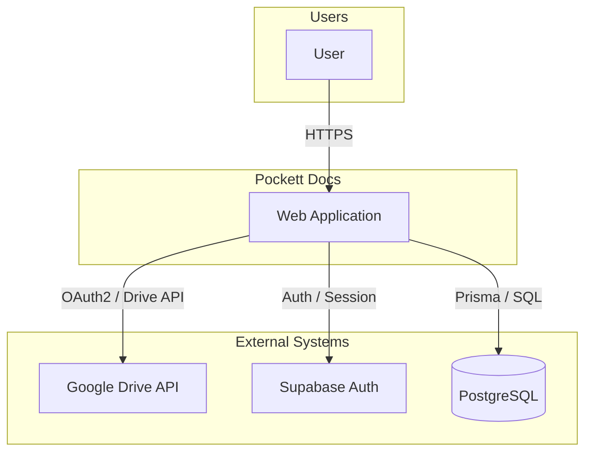
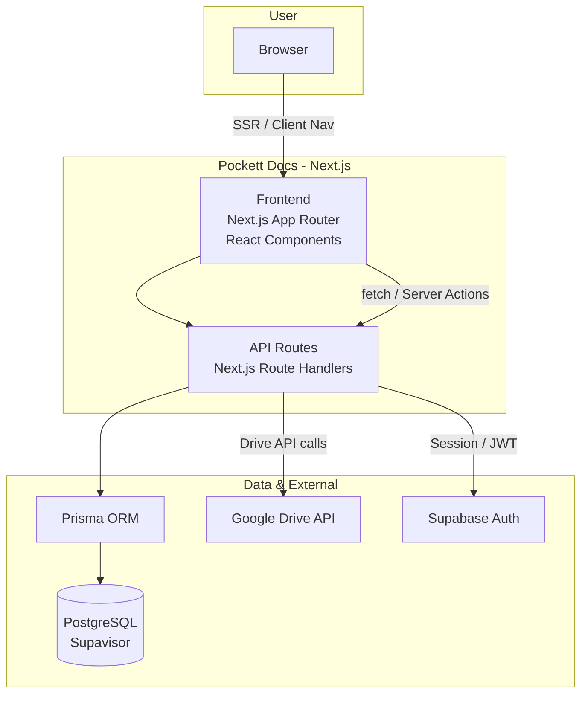
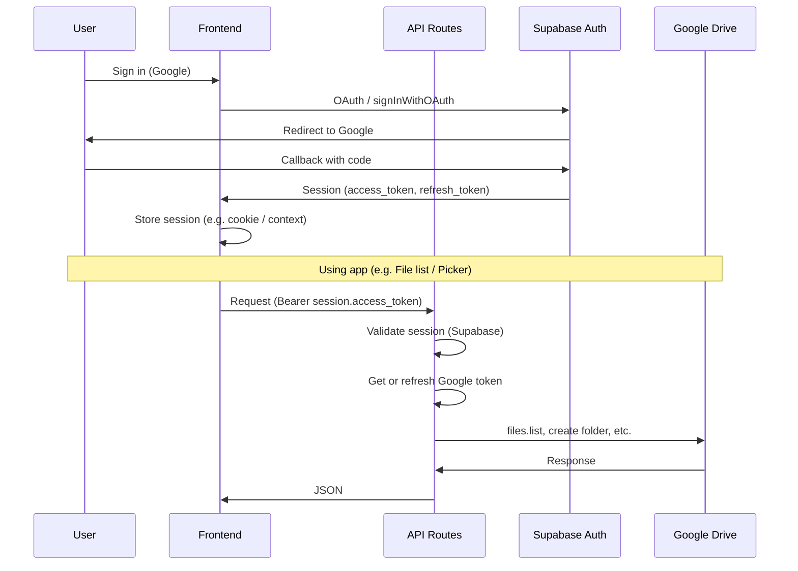
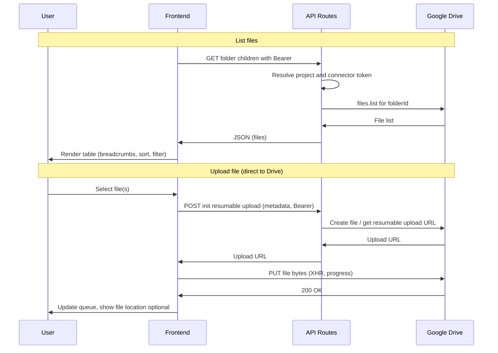
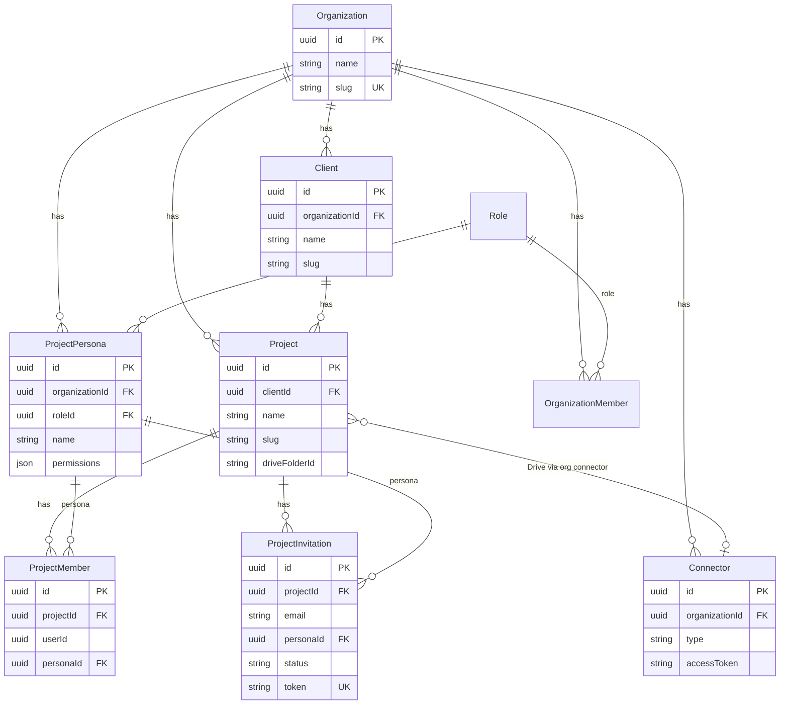
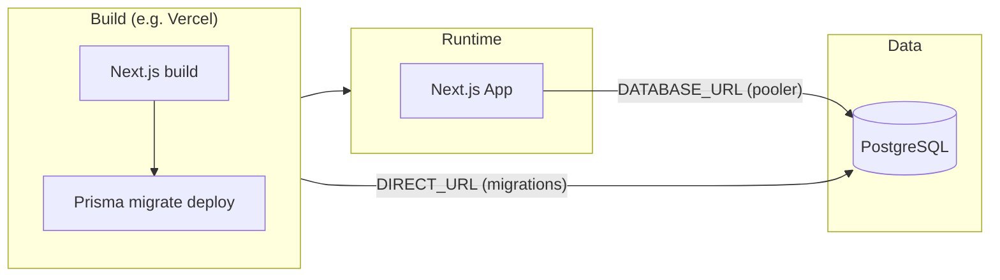

# High-Level Design (HLD): Pockett Docs MVP

This document describes the high-level architecture of the Pockett Docs MVP using Mermaid diagrams. It aligns with the [PRD](prd.md) and [Roadmap](roadmap.md).

**Revision:** MVP · Last updated with current implementation (file browser, Drive picker, members, invitations).

---

## Design Principles

| Principle | Description |
|-----------|-------------|
| **Direct-to-Drive** | File bytes go browser → Google Drive (resumable upload). Pockett servers never store or proxy file content; only metadata and upload URLs. |
| **Multi-tenant** | All data is scoped by Organization. Clients and Projects belong to an org; access is enforced via roles (ORG_OWNER, ORG_MEMBER, ORG_GUEST) and project personas. |
| **Headless Drive** | Pockett is the UI; Google Drive is the storage backend. Folder structure is created at project creation; file list and uploads use Drive API and Picker. |
| **Session-first auth** | Supabase handles Google OAuth and session. API routes validate session and resolve org/client/project context; connector tokens are used for Drive API on behalf of the org. |

---

## Technology Stack

| Layer | Technology |
|-------|------------|
| **Frontend** | Next.js (App Router), React, TypeScript |
| **API** | Next.js Route Handlers (REST), Server Actions where applicable |
| **Database** | PostgreSQL (Supavisor), Prisma ORM |
| **Auth** | Supabase Auth (Google OAuth) |
| **Storage / Files** | Google Drive API (metadata + resumable uploads), no Pockett file storage |
| **Hosting** | Vercel (Next.js build + postbuild Prisma migrate deploy) |
| **Observability** | Sentry (client, server, edge), structured logging |

---

## URL Structure

Main application routes:

| Route | Purpose |
|-------|---------|
| `/onboarding` | New user workspace creation (no org yet) |
| `/dash` | Dashboard; redirects to last-used client workspace |
| `/o/[slug]` | Organization scope (e.g. org home, connectors, insights) |
| `/o/[slug]/c/[clientSlug]` | Client scope; project list |
| `/o/[slug]/c/[clientSlug]/p/[projectSlug]` | Project workspace (Files, Members, Shares, Insights, Sources tabs) |
| `/invite/[token]` | Invitation redemption (sign-in/sign-up → project) |

Slugs are URL-friendly (org, client, project names). IDs are used in API and DB.

---

## Key API Surface

Main API route groups used by the app (Next.js Route Handlers under `app/api/`). LLD should specify request/response schemas, auth, and error handling per endpoint.

| Route group | Purpose |
|-------------|---------|
| `POST /api/organization/create` | Create organization (onboarding). |
| `GET/POST /api/organization`, `GET /api/organizations` | Org CRUD and list. |
| `GET /api/connectors/google-drive?action=token` | Get Google access token for Picker/Drive API. |
| `POST /api/connectors/google-drive/upload` | Init resumable upload (returns Drive upload URL); no file body. |
| `POST /api/connectors/google-drive/import` | Process Import from Drive (copy/shortcut selected files). |
| `GET /api/connectors/google-drive/callback` | OAuth callback for Google Drive connector. |
| `GET /api/documents/download` | Proxy or signed URL for document download. |
| `GET /api/drive-summary`, `GET /api/drive-metrics`, `POST /api/drive-action` | Drive summary, metrics, and actions (e.g. list children). |
| `POST /api/provision` | Provision project + Drive folder (project creation). |

All authenticated routes expect `Authorization: Bearer <session.access_token>`. Org/client/project context is derived from request or path.

---

## Key Frontend Anchors

Main UI entry points and components that LLD can break down into subcomponents, state, and API calls.

| Area | Entry / key components |
|------|-------------------------|
| **Onboarding** | `app/onboarding/page.tsx` — workspace name, slug, create org. |
| **Dashboard** | `app/dash/` — redirect to last client; sidebar layout. |
| **Org / Client / Project** | `app/o/[slug]/layout.tsx`, `c/[clientSlug]/page.tsx`, `p/[projectSlug]/page.tsx` — hierarchy; `ProjectWorkspace` with tabs. |
| **Project Files** | `ProjectFileList` — file table, breadcrumbs, Add menu, filters, sort, upload queue, Import from Drive, row actions. |
| **Project Members** | `ProjectMembersTab` — member list, invite modal, persona assignment. |
| **Connectors** | `app/o/[slug]/connectors/page.tsx` — Google Drive connect, link folders. |
| **Invitation** | `app/invite/[token]/page.tsx` — redeem invite, sign-in/sign-up, join project. |

---

## Security & Compliance

### Authentication & Authorization

- **Authentication:** Supabase session (JWT). All API routes that need auth validate the session and resolve the user.
- **Authorization:** Org and project membership plus roles (ORG_OWNER, ORG_MEMBER, ORG_GUEST) and project personas. Invitation flow ensures invitee email matches authenticated user (no link forwarding).
- **Data scope:** Queries are scoped by `organizationId` (and client/project where applicable) in application code. Connector tokens are org-scoped; Drive folder IDs are stored per project. **Database:** Row-Level Security (RLS) — see Data & PII Protection.

---

### Direct-to-Drive Upload Security

File content never transits or persists on Pockett servers. Security measures (current and recommended):

| Measure | Current | Recommended (enterprise) |
|--------|----------|---------------------------|
| **Transport** | Browser → Google Drive over HTTPS (TLS 1.3). Pockett API only returns a resumable upload URL. | Same; enforce TLS 1.2+ and HSTS in production. |
| **Server-side file handling** | None. No file bytes stored or proxied. | Maintain this; do not introduce server-side buffering of file content. |
| **Upload URL lifecycle** | API issues one-time resumable URL; client uploads directly to Drive. | Short-lived upload URLs (e.g. 1-hour expiry); no reuse. Revoke or scope URLs to a single session/request. |
| **Token handling** | Connector OAuth tokens used server-side only to obtain upload URL; tokens not sent to browser. | Store tokens in server-side secrets or vault; never log or expose in responses. Rotate tokens on revoke. |
| **Validation** | Project and folder resolved from DB; upload URL scoped to project’s Drive folder. | Validate project membership and folder ownership before issuing upload URL; rate-limit per user/org. |
| **Audit** | (Optional) Log upload init (who, project, folder) without file content. | Log upload events (user, org, project, folderId, timestamp) for compliance and forensics. |

---

### Data & PII Protection

| Area | Current | Recommended (enterprise) |
|------|---------|---------------------------|
| **Row-Level Security (RLS)** | Access enforced in application layer only (Prisma queries filter by `organizationId` / `clientId` / `projectId`). No RLS policies at DB level. | **Enable PostgreSQL RLS** per table as below. Use `current_setting('app.current_org_id')` and, for project-scoped tables, project-membership checks. See **RLS multi-tenancy strategy** below. |
| **Encryption in transit** | HTTPS for all client–server and server–DB traffic. | TLS 1.2+ everywhere; DB connection over TLS (Supavisor supports this). |
| **Encryption at rest (DB)** | Provided by DB host (e.g. Supabase/Postgres disk encryption). | Confirm provider uses AES-256 or equivalent; use encrypted backups. |
| **PII in database** | Email, names, and other PII stored in plaintext in PostgreSQL. | **Field-level or column-level encryption** for sensitive PII (e.g. email, display name in invitations/members). Use a KMS (e.g. AWS KMS, HashiCorp Vault) and encrypt before write, decrypt in app layer. Key rotation without re-encrypting all data (e.g. envelope encryption) as roadmap. |
| **Secrets** | Connector tokens and API keys in env / server config. | Secrets in a vault (e.g. Vercel env, Doppler, AWS Secrets Manager); no secrets in code or logs. |
| **Logging** | Structured logs; Sentry. | Redact or omit PII from logs (email, names, tokens). Use placeholders (e.g. `user_id=xxx`) for debugging. |
| **Retention** | No formal policy. | Define retention for PII and audit logs; automated purge or archive per policy and jurisdiction (e.g. GDPR). |

---

### RLS multi-tenancy strategy

Multi-tenancy is at **organization level** (tenant = Organization). RLS can and should be applied at **different levels for different tables**:

| Level | Tables | Policy basis | Notes |
|-------|--------|--------------|--------|
| **Org-level** | `organizations`, `clients`, `projects`, `connectors`, `project_personas`, `organization_members` | Restrict by `organization_id = current_setting('app.current_org_id')::uuid`. For `organizations`, `id = current_setting('app.current_org_id')::uuid`. | User may only see rows belonging to the org they are acting in. App sets `app.current_org_id` per request (e.g. from path or session). |
| **Project-level (project-membership)** | `project_members`, `project_invitations` | Restrict to rows where the user is a member of that project, e.g. `project_id IN (SELECT project_id FROM project_members WHERE user_id = current_setting('app.current_user_id')::uuid)`. | Only project members may see that project’s members and invitations. Avoids org-wide visibility of project-scoped data. |
| **Org or project (by model)** | `documents`, `linked_files` | If project-scoped: same as project-level. If org-scoped: by `organization_id`. | Align with how the app uses these tables (e.g. `documents` has `organizationId` and optional `projectId`). |

**Summary:** Use **org-level RLS** for org-owned tables; use **project-level (membership-based) RLS** for project-scoped tables. Different tables may have RLS at different levels.

**Review (current state vs strategy):** The **data model** (Prisma schema) is aligned: org-scoped tables have `organizationId`; project-scoped tables (`project_members`, `project_invitations`) have `projectId` and no direct `organizationId`. **Application code** scopes queries by `organizationId` or `projectId` in `lib/actions` and API routes (e.g. hierarchy, client, project, members, invitations, personas; connectors and upload resolve org via membership). **Migrations:** No RLS policies exist in Prisma migration SQL; access control is application-layer only. When RLS is implemented, apply the table-level strategy above and set `app.current_org_id` / `app.current_user_id` per request (e.g. in middleware or API wrapper).

---

### Enterprise Best Practices (Current & Recommended)

| Practice | Current | Recommended |
|----------|---------|-------------|
| **Access reviews** | Manual. | Periodic review of org/project members and roles; deprovision on leave. |
| **SSO / SAML** | Google OAuth only. | Optional SAML/SSO for orgs (e.g. Okta, Azure AD) for enterprise customers. |
| **Audit logging** | Ad hoc. | Immutable audit log for sensitive actions (invite, role change, connector link, project create/delete). Store in append-only store or dedicated audit table with tamper detection. |
| **Backup & DR** | DB backups as per provider. | Automated DB backups; tested restore; RPO/RTO defined. Document recovery runbook. |
| **Incident response** | — | Runbook for breach or exposure; notification process; post-incident review. |
| **Compliance** | — | Map controls to SOC 2, GDPR, or HIPAA as needed; document in a security/compliance doc. |

---

**How to view the diagrams (Markdown Preview Mermaid Support):**
1. Open this file (`hld.md`) and use **Markdown: Open Preview** (**Cmd+Shift+V** / **Ctrl+Shift+V**) — *not* another extension’s preview (e.g. “Markdown Preview Enhanced”).
2. **If diagrams disappear after closing and reopening the preview:** Use **Markdown: Open Preview to the Side** (**Cmd+K V** / **Ctrl+K V**) and keep that preview pane open. The side preview tends to re-render Mermaid more reliably than reopening a closed tab. If it still doesn’t show diagrams, run **Developer: Reload Window** (Cmd+Shift+P → “Reload Window”), then open preview again.
3. Alternative: copy a `mermaid` code block into [mermaid.live](https://mermaid.live) or push and view on GitHub.

---

## 1. System Context (C4 Level 1)

Users interact with the Pockett web application. Pockett uses Google Drive for file storage, Supabase for authentication, and PostgreSQL (Supavisor) for application data.

---

## 2. Container Diagram (C4 Level 2)

The web application is a Next.js app comprising the browser UI and API routes. Application data is stored in PostgreSQL; file content lives in Google Drive.

---

## 3. Authentication Flow

Users sign in with Google (Supabase). Session is used for API authorization and for obtaining a Google access token (e.g. for Drive Picker and Drive API).

---

## 4. Project File List & Upload Flow

File browser lists contents of the project’s Drive folder. Uploads go directly from the browser to Google Drive (resumable upload); the API only issues the upload URL and metadata.

---

## 5. Core Data Model (Simplified)

Organizations contain Clients and Connectors. Projects belong to a Client and reference a Drive folder. Members and Invitations are scoped to Organization and Project; Personas define project-level roles.

---

## 6. Deployment Context

Next.js is built and deployed (e.g. Vercel). PostgreSQL is hosted (e.g. Supabase/Supavisor). Environment distinguishes runtime URL (transaction pooler) vs migration URL (session pooler).

---

## Glossary

| Term | Definition |
|------|------------|
| **Organization** | Top-level tenant; owns clients, projects, connectors, and personas. Users belong to one or more orgs via roles. |
| **Client** | Customer or entity (e.g. “Acme Corp”); belongs to an org; contains projects. |
| **Project** | Engagement or case; belongs to a client; linked to one Google Drive folder; has tabs (Files, Members, Shares, Insights, Sources). |
| **Connector** | Org-level link to an external service (e.g. Google Drive); stores OAuth tokens; used for Drive folder sync and Import from Drive. |
| **Persona** | Project-level role template (e.g. Project Owner, Internal Member, Associate, Client); defines permissions; assigned to members and invitations. |

---

## From HLD to Low-Level Design (LLD)

This HLD is structured so that a Low-Level Design can be derived from it without ambiguity. The sections below provide **steps to create an LLD** and a **mapping from each HLD section to LLD deliverables**, demonstrating that the HLD is detailed enough to prepare an LLD.

### Sufficiency for LLD

The HLD provides:

- **System and container boundaries** (C4 L1/L2) → LLD can zoom into components and classes per container.
- **Flows** (auth, file list, upload) → LLD can add API-level and DB-level sequence diagrams, request/response schemas.
- **Data model** (ER diagram + tables) → LLD can define physical schema, indexes, migrations, and RLS policies.
- **API surface** (route groups and purpose) → LLD can specify each endpoint’s method, path, body, headers, errors, and auth.
- **Frontend anchors** (pages and key components) → LLD can specify component tree, props, state, and API calls per screen.
- **Security and compliance** (direct-to-Drive, PII, RLS, enterprise practices) → LLD can specify concrete controls (e.g. RLS policy SQL, encryption fields, audit log schema).

### Steps to Create an LLD from This HLD

1. **Choose a scope** — Pick one or more areas (e.g. “Project Files”, “Invitations”, “Connectors”) so the LLD stays bounded.
2. **Derive component view (C4 L3)** — For each container (Frontend, API), list components/modules that implement the flows in §3–§4. For example: `ProjectFileList`, `useDrivePicker`, `GET /api/connectors/google-drive/upload`, `listDriveChildren` in `google-drive-connector`.
3. **Specify API contracts** — For each route in **Key API Surface**, document: HTTP method and path, request body/query/headers, response shape, error codes, and how auth/org/project context is passed. Optionally add OpenAPI or TypeScript types.
4. **Specify data access** — For each flow that touches the DB, list Prisma models and queries (or raw SQL). From **Core Data Model** and **Security (RLS)**, write migration-ready schema changes and RLS policy definitions (e.g. `CREATE POLICY ... ON clients USING (organization_id = current_setting('app.current_org_id')::uuid)`).
5. **Specify UI behavior** — For each **Key Frontend Anchors** component, document: props, local state, server state (e.g. SWR/query keys), API calls, and error/loading UI. Add wireframes or acceptance criteria if needed.
6. **Specify security controls** — From **Security & Compliance**, turn recommendations into concrete LLD items: which tables get RLS, which PII columns get encryption, audit log table schema, and where to set `app.current_org_id` (e.g. middleware or API wrapper).
7. **Cross-check** — Ensure every flow in §3–§4 is covered by at least one API contract, one data-access spec, and one UI spec; and that every security requirement maps to an implementable control.

### HLD Section → LLD Deliverable Mapping

| HLD section | LLD deliverable |
|-------------|------------------|
| **Design principles** | Constraints and non-goals in LLD intro; used to reject out-of-scope designs. |
| **Technology stack** | Stack is fixed; LLD specifies libraries, versions, and patterns within that stack. |
| **URL structure** | Route table; LLD adds page components, layout, and data-fetching per route. |
| **Key API surface** | Per-endpoint spec: method, path, request/response, errors, auth. Optionally OpenAPI. |
| **Key frontend anchors** | Per-component spec: props, state, API calls, subcomponents. Optionally wireframes. |
| **Security & compliance** | RLS policy definitions; PII encryption fields and KMS usage; audit log schema; secrets handling. |
| **§1 System context** | No LLD expansion; used to validate that LLD does not introduce new system-level actors or boundaries. |
| **§2 Container diagram** | C4 L3 component diagram per container (Frontend modules, API route groups, shared libs). |
| **§3 Authentication flow** | Sequence diagram at API/DB level; session validation and token refresh logic; middleware spec. |
| **§4 File list & upload flow** | Sequence diagram at API/DB level; upload init and Drive API call specs; frontend upload state machine. |
| **§5 Core data model** | Physical schema (Prisma or SQL); indexes; migration files; RLS policies per table. |
| **§6 Deployment context** | Build and deploy steps; env vars; DATABASE_URL vs DIRECT_URL usage. |
| **Glossary** | Terms used consistently in LLD; extend with domain terms introduced in LLD. |

Using this mapping, an implementer can produce LLD documents (e.g. one per epic or module) that trace back to this HLD and prove that the HLD is detailed enough to prepare an LLD.

---

## References

- [PRD](prd.md) – Product requirements and feature list
- [Roadmap](roadmap.md) – Milestones and schedule
- [AGENTS.md](../../AGENTS.md) – Database migrations, Vercel, Git workflow
